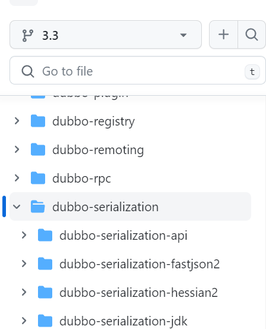
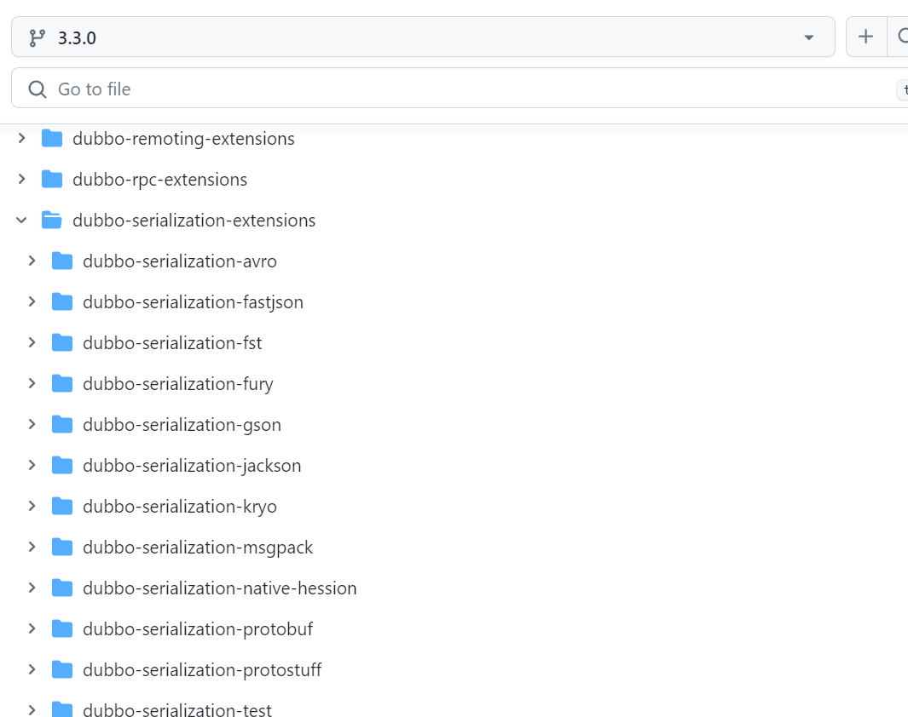
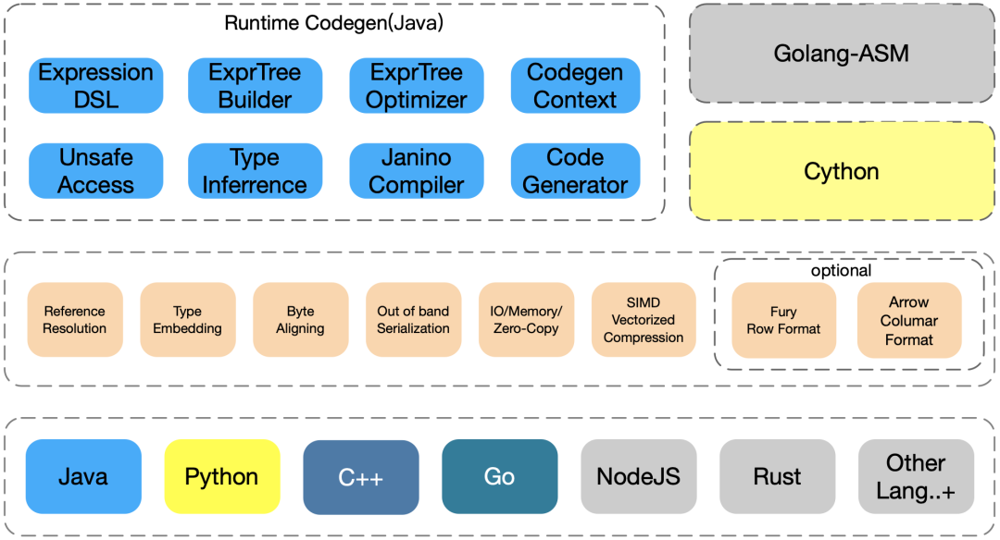

# ✅Dubbo支持哪些序列化方式？

# 典型回答

Dubbo是RPC框架，需要远程调用，那么就需要把请求和响应做序列化和反序列化。Dubbo目前支持多种序列化协议。

在[Dubbo 3.0](https://github.com/apache/dubbo/tree/3.3/dubbo-serialization) 中，内置了3种序列化协议：

比较常见的有：

1. **Hessian2**：hessian是一种跨语言的高效二进制序列化方式。但这里实际不是原生的hessian2序列化，而是阿里修改过的hessian lite，它是dubbo RPC默认启用的序列化方式
2. **Java**：标准的Java序列化协议，易于使用但性能相对较低。
3. **fastjson2**：轻量级的数据交换格式，适用于简单的数据结构，易于阅读和调试。

这里面，hessian2是默认的，主要是因为他的性能是最好的，并且它支持跨语言。

而这几年，各种序列化框架层出不穷，今天出了一个号称速度快，明天出一个号称跨语言。总之有很多，于是在[Dubbo的扩展](https://github.com/apache/dubbo-spi-extensions)中，就增加支持很多其他的序列化协议：

其中包括了avro、fastjson、fst、fury、gson、Jackson、kryo、msgpack、protobuf和protostuff等。

这里面很多框架其实性能都比较好，大有代替Hession的势头，比如Kryo、FST、fury等。

比如蚂蚁出的fury框架，号称比hessian快100倍，以下是他的一个整体介绍。详见：[https://developer.aliyun.com/article/992485](https://developer.aliyun.com/article/992485)

> 更新: 2025-07-21 22:11:12  
> 原文: <https://www.yuque.com/hollis666/oolnrs/xgwzlb4bp9dhg3r0>