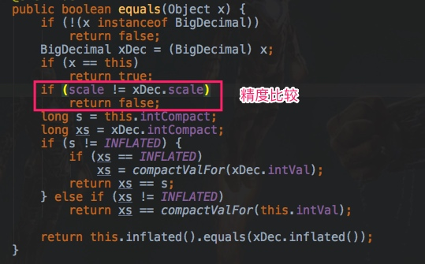
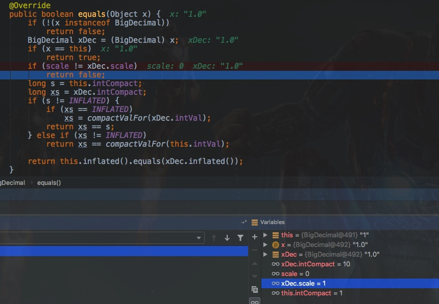
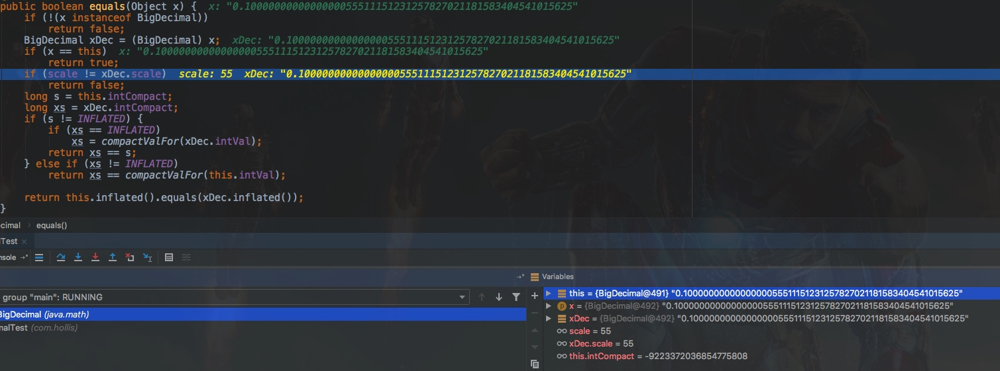
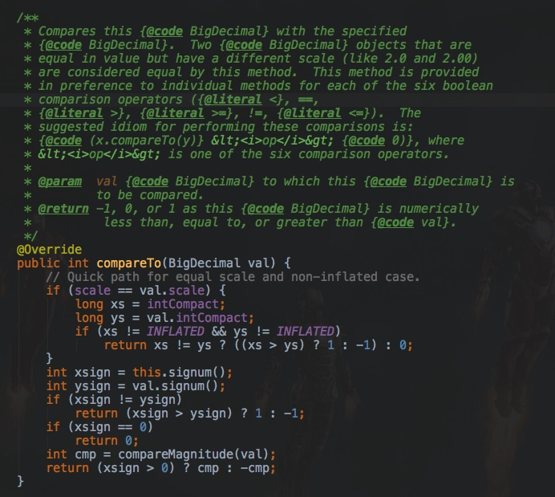

# ✅为什么不能用BigDecimal的equals方法做等值比较？

# 典型回答


因为BigDecimal的equals方法和compareTo并不一样，equals方法会比较两部分内容，分别是值（value）和标度（scale），而对于0.1和0.10这两个数字，他们的值虽然一样，但是精度是不一样的，所以在使用equals比较的时候会返回false。


# 扩展知识
BigDecimal，相信对于很多人来说都不陌生，很多人都知道他的用法，这是一种java.math包中提供的一种可以用来进行精确运算的类型。


很多人都知道，在进行金额表示、金额计算等场景，不能使用double、float等类型，而是要使用对精度支持的更好的BigDecimal。


所以，很多支付、电商、金融等业务中，BigDecimal的使用非常频繁。而且不得不说这是一个非常好用的类，其内部自带了很多方法，如加，减，乘，除等运算方法都是可以直接调用的。


除了需要用BigDecimal表示数字和进行数字运算以外，代码中还经常需要对于数字进行相等判断。


关于这个知识点，在最新版的《阿里巴巴Java开发手册》中也有说明：


这背后的思考是什么呢？

## BigDecimal的比较


我在之前的CodeReview中，看到过以下这样的低级错误：


```plain
if(bigDecimal == bigDecimal1){
    // 两个数相等
}
```


这种错误，相信聪明的读者一眼就可以看出问题，**因为BigDecimal是对象，所以不能用**`**==**`**来判断两个数字的值是否相等。**


以上这种问题，在有一定的经验之后，还是可以避免的，但是聪明的读者，看一下以下这行代码，你觉得他有问题吗：


```plain
if(bigDecimal.equals(bigDecimal1)){
    // 两个数相等
}
```


可以明确的告诉大家，以上这种写法，可能得到的结果和你预想的不一样！


先来做个实验，运行以下代码：


```plain
BigDecimal bigDecimal = new BigDecimal(1);
BigDecimal bigDecimal1 = new BigDecimal(1);
System.out.println(bigDecimal.equals(bigDecimal1));


BigDecimal bigDecimal2 = new BigDecimal(1);
BigDecimal bigDecimal3 = new BigDecimal(1.0);
System.out.println(bigDecimal2.equals(bigDecimal3));


BigDecimal bigDecimal4 = new BigDecimal("1");
BigDecimal bigDecimal5 = new BigDecimal("1.0");
System.out.println(bigDecimal4.equals(bigDecimal5));
```


以上代码，输出结果为：


```plain
true
true
false
```


## BigDecimal的equals原理


通过以上代码示例，我们发现，在使用BigDecimal的equals方法对1和1.0进行比较的时候，有的时候是true（当使用int、double定义BigDecimal时），有的时候是false（当使用String定义BigDecimal时）。


那么，为什么会出现这样的情况呢，我们先来看下BigDecimal的equals方法。


在BigDecimal的JavaDoc中其实已经解释了其中原因：


```plain
Compares this  BigDecimal with the specified Object for equality.  Unlike compareTo, this method considers two BigDecimal objects equal only if they are equal in value and scale (thus 2.0 is not equal to 2.00 when compared by  this method)
```


大概意思就是，**equals方法和compareTo并不一样，equals方法会比较两部分内容，分别是值（value）和标度（scale）**

对应的代码如下：





所以，我们以上代码定义出来的两个BigDecimal对象（bigDecimal4和bigDecimal5）的标度是不一样的，所以使用equals比较的结果就是false了。


尝试着对代码进行debug，在debug的过程中我们也可以看到bigDecimal4的标度是0，而bigDecimal5的标度是1。





到这里，我们大概解释清楚了，之所以equals比较bigDecimal4和bigDecimal5的结果是false，是因为标度不同。


那么，为什么标度不同呢？为什么bigDecimal2和bigDecimal3的标度是一样的（当使用int、double定义BigDecimal时），而bigDecimal4和bigDecimal5却不一样（当使用String定义BigDecimal时）呢？


## 为什么标度不同


这个就涉及到BigDecimal的标度问题了，这个问题其实是比较复杂的，由于不是本文的重点，这里面就简单介绍一下吧。大家感兴趣的话，后面单独讲。


首先，BigDecimal一共有以下4个构造方法：


```plain
BigDecimal(int)
BigDecimal(double) 
BigDecimal(long) 
BigDecimal(String)
```


以上四个方法，创建出来的的BigDecimal的标度是不同的。


#### BigDecimal(long) 和BigDecimal(int)


首先，最简单的就是**BigDecimal(long) 和BigDecimal(int)，因为是整数，所以标度就是0** ：


```plain
public BigDecimal(int val) {
    this.intCompact = val;
    this.scale = 0;
    this.intVal = null;
}

public BigDecimal(long val) {
    this.intCompact = val;
    this.intVal = (val == INFLATED) ? INFLATED_BIGINT : null;
    this.scale = 0;
}
```


#### BigDecimal(double)


而对于BigDecimal(double) ，**当我们使用new BigDecimal(0.1)创建一个BigDecimal 的时候，其实创建出来的值并不是整好等于0.1的，而是0.1000000000000000055511151231257827021181583404541015625 。这是因为double自身表示的只是一个近似值。**


那么，无论我们使用new BigDecimal(0.1)还是new BigDecimal(0.10)定义，他的近似值都是0.1000000000000000055511151231257827021181583404541015625这个，那么他的标度就是这个数字的位数，即55。





其他的浮点数也同样的道理。对于new BigDecimal(1.0)这样的形式来说，因为他本质上也是个整数，所以他创建出来的数字的标度就是0。


所以，因为BigDecimal(1.0)和BigDecimal(1.00)的标度是一样的，所以在使用equals方法比较的时候，得到的结果就是true。


#### BigDecimal(string)


而对于BigDecimal(String) ，**当我们使用new BigDecimal("0.1")创建一个BigDecimal 的时候，其实创建出来的值正好就是等于0.1的。那么他的标度也就是1。**


如果使用new BigDecimal("0.10000")，那么创建出来的数就是0.10000，标度也就是5。


所以，因为BigDecimal("1.0")和BigDecimal("1.00")的标度不一样，所以在使用equals方法比较的时候，得到的结果就是false。


## 如何比较BigDecimal


前面，我们解释了BigDecimal的equals方法，其实不只是会比较数字的值，还会对其标度进行比较。


所以，当我们使用equals方法判断判断两个数是否相等的时候，是极其严格的。


那么，如果我们只想判断两个BigDecimal的值是否相等，那么该如何判断呢？


**BigDecimal中提供了compareTo方法，这个方法就可以只比较两个数字的值，如果两个数相等，则返回0。**


```plain
    BigDecimal bigDecimal4 = new BigDecimal("1");
    BigDecimal bigDecimal5 = new BigDecimal("1.0000");
    System.out.println(bigDecimal4.compareTo(bigDecimal5));
```


以上代码，输出结果：


```plain
0
```


其源码如下：





> 更新: 2025-07-21 22:10:49  
> 原文: <https://www.yuque.com/hollis666/oolnrs/qmx8yss8tve7w73q>