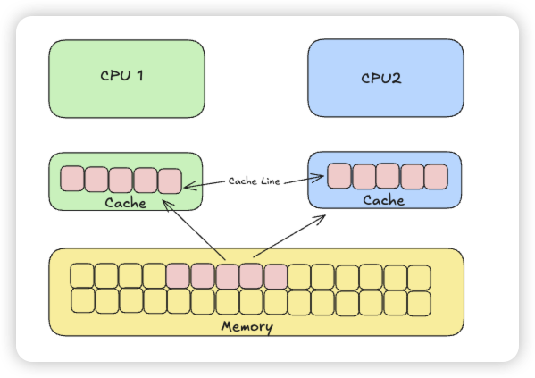
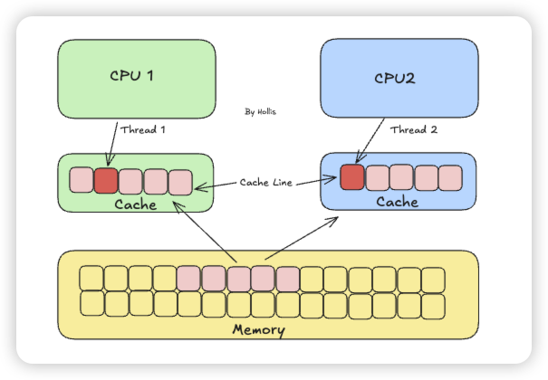

# ✅什么是伪共享，如何解决伪共享？

# 典型回答


伪共享（False Sharing）是并发编程中一种性能问题，发生在多线程访问位于同一缓存行（cache line）中的不同变量时，导致缓存频繁失效和同步开销增大，从而严重影响程序性能。（概念看不懂没关系，继续看后面就懂了）


先看下这两篇文章，对于操作系统的CPU缓存和MESI有所了解后继续看。


[✅什么是操作系统的多级缓存](https://www.yuque.com/hollis666/oolnrs/nm0sde8ek7ccfg1w)


[✅什么是MESI缓存一致性协议](https://www.yuque.com/hollis666/oolnrs/gg2n5fqckk442ouf)


<font style="color:rgb(64, 64, 64);">我们都知道，现代 CPU 使用缓存来弥补处理器与主内存之间的巨大速度差异。数据在主内存和 CPU 缓存（L1、L2、L3）之间传输的最小单位称为</font>**<font style="color:rgb(64, 64, 64);">缓存行</font>**<font style="color:rgb(64, 64, 64);">，一般是64字节。</font>

<font style="color:rgb(64, 64, 64);"></font>



<font style="color:rgb(64, 64, 64);"></font>

<font style="color:rgb(64, 64, 64);">为了保证多核 CPU 看到的内存视图是一致的，处理器使用如 MESI协议来协调各个核心的缓存状态。当一个核心修改了其缓存行中的数据时，该缓存行在其他核心中的副本会被标记为无效。其他核心后续访问该缓存行时需要重新从修改核心的缓存或主内存中加载最新数据。</font>

<font style="color:rgb(64, 64, 64);"></font>

<font style="color:rgb(64, 64, 64);">那么，当多个线程在不同的 CPU 核心上运行时，它们就可能访问物理上相邻（位于同一个缓存行内）但逻辑上独立（被不同线程修改）的变量。</font>

<font style="color:rgb(64, 64, 64);"></font>

<font style="color:rgb(64, 64, 64);">如果一个线程（线程1）修改了它自己关心的变量（变量 X），而这个变量恰好与另一个线程（线程2）关心的变量（变量 Y）位于</font>**<font style="color:rgb(64, 64, 64);">同一个缓存行</font>**<font style="color:rgb(64, 64, 64);">中。</font>




<font style="color:rgb(64, 64, 64);">由于缓存一致性协议是基于缓存行操作的，线程 A 对 X 的修改会导致</font>**<font style="color:rgb(64, 64, 64);">整个缓存行</font>**<font style="color:rgb(64, 64, 64);">在其他核心的缓存中失效。</font>

<font style="color:rgb(64, 64, 64);"></font>

<font style="color:rgb(64, 64, 64);">当线程 B 需要访问它自己的变量 Y（即使 Y 本身没有被线程 A 修改）时，因为它所在的整个缓存行都失效了，线程 B 的 CPU 核心必须：</font>

1. <font style="color:rgb(64, 64, 64);">从持有最新数据（可能是线程 A 的缓存或主内存）的源重新加载整个缓存行。</font>
2. <font style="color:rgb(64, 64, 64);">这会导致一次缓存未命中，迫使线程 B 等待数据加载完成。</font>


<font style="color:rgb(64, 64, 64);">同样，线程 B 修改 Y 也会导致线程 A 的缓存行失效。</font>

<font style="color:rgb(64, 64, 64);"></font>

**<font style="color:rgb(64, 64, 64);">线程 1 和 线程2 在逻辑上操作的是完全不同的变量（X 和 Y），仅仅因为它们物理上靠得太近（在同一个缓存行内），就导致了彼此缓存行的频繁失效和重新加载。这种无效的共享就是“伪共享”</font>**<font style="color:rgb(64, 64, 64);">。</font>

<font style="color:rgb(64, 64, 64);"></font>

伪共享的会带来很多问题：

+ 性能下降： 频繁的缓存失效和重新加载导致 CPU 大量时间花在等待数据上。
+ 可伸缩性差： 随着 CPU 核心数量的增加，伪共享导致的缓存一致性开销会成倍增长，程序无法有效利用多核资源。
+ 难以诊断： 性能瓶颈的根源（物理内存布局）与代码逻辑（变量访问）分离，使用常规的性能分析工具（如 profiler）很难直接定位到伪共享问题。


**解决伪共享，核心的方案就是想办法让不同线程频繁访问的独立变量位于不同的缓存行中。** 主要有以下几种方法：


### 填充


在关键变量周围添加无用的“填充”字节，确保每个关键变量独占一个缓存行。


在Java 8+中，使用`Contended` 注解，就可以使得被标注的字段单独占用一个缓存行。如下面的x。


```java
public class Foo {
    @Contended
    long x;
    long y;
}
```


这个方案的优点是简单，直接，缺点很容易理解，以为有很多填充导致的内存浪费。


### 线程局部存储


如果变量完全不需要在线程间共享，只是每个线程自己使用，那么可以使用ThreadLocal。这样每个线程都有自己独立的副本，物理上自然就不会共享缓存行了。


### 使用支持并发数据结构
一些高级的并发库在设计数据结构（如无锁队列、并发哈希表）时，内部已经采用了填充、对齐等技术来避免伪共享（例如 Java 的 `java.util.concurrent.atomic` 包中的 `Striped64` 及其子类 `LongAdder`）。


> 更新: 2025-07-25 23:11:47  
> 原文: <https://www.yuque.com/hollis666/oolnrs/lq5iu3e8gwpwm1w4>