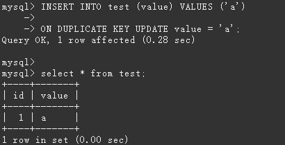

# ✅SQL语句如何实现insertOrUpdate的功能？

# 典型回答


在 MySQL 中，可以使用` INSERT INTO ... ON DUPLICATE KEY UPDATE `语句实现 insertOrUpdate 功能。


> <font style="color:rgb(33, 37, 41);">需要</font>**<font style="color:rgb(33, 37, 41);">注意</font>**<font style="color:rgb(33, 37, 41);">：在on duplicate key时，会在前一个索引值到当前值加临键锁，极容易造成死锁。</font>
>


要使用` INSERT INTO ... ON DUPLICATE KEY UPDATE` 语句，需要满足以下条件：

1. 表必须有主键或唯一索引；
2. 插入的数据必须包含主键或唯一索引列；
3. 主键或唯一索引列的值不能为 NULL。


举个栗子：


假设有一个 student 表，包含 id、name 和 age 三列，其中 id 是主键。现在要插入一条数据，如果该数据的主键已经存在，则更新该数据的姓名和年龄，否则插入该数据。


```plain
INSERT INTO student (id, name, age) VALUES (1, 'Alice', 20)
ON DUPLICATE KEY UPDATE name='Alice', age=20;
```


# 扩展知识


## 实现原理
`INSERT INTO ... ON DUPLICATE KEY UPDATE `，如果数据库中已存在具有相同唯一索引或主键的记录，则更新该记录。其底层原理和执行流程如下：


1. 检查唯一索引或主键：当执行 INSERT INTO ... ON DUPLICATE KEY UPDATE 语句时，数据库首先尝试插入新行。在此过程中，数据库会检查表中是否存在与新插入行具有相同的唯一索引或主键的记录。
2. 冲突处理：如果不存在冲突的唯一索引或主键，新行将被正常插入。如果存在冲突，即发现重复的唯一索引或主键值，数据库将不会插入新行，而是转而执行更新操作。
3. 执行更新：在检测到唯一索引或主键的冲突后，数据库将根据 ON DUPLICATE KEY UPDATE 后面指定的列和值来更新已存在的记录。这里可以指定一个或多个列进行更新，并且可以使用 VALUES 函数引用原本尝试插入的值。


## 类似SQL


除了INSERT INTO ... ON DUPLICATE KEY UPDATE，还有一些类似的 SQL 语句，比如：


1. REPLACE INTO: 如果存在唯一索引冲突，则先删除旧记录，再插入新记录。


2. INSERT IGNORE INTO: 如果唯一索引冲突，则忽略该条插入操作，不报错。


## 主键跳跃


在 MySQL 中使用 `INSERT ON DUPLICATE KEY UPDATE` 语句时，如果插入操作失败（因为主键或唯一键冲突），而执行了更新操作，确实会导致自增主键计数器增加，即使没有实际插入新记录。


这是因为 MySQL 在尝试插入新记录时，会先分配一个新的自增主键值，无论后续是插入成功还是执行更新操作，这个主键值都已经被分配并且会增加。


例如，假设有一个表 `test` 定义如下：


```sql
CREATE TABLE test (
    id INT AUTO_INCREMENT PRIMARY KEY,
    value VARCHAR(255),
    UNIQUE KEY unique_value (value)
);
```


然后执行以下语句：


```sql
INSERT INTO test (value) VALUES ('a') 
ON DUPLICATE KEY UPDATE value = 'a';
```





再执行一次：


此时，由于 `value` 列存在唯一键约束，并且已经存在一条记录 `value = 'a'`，所以不会插入新记录，而是会执行更新操作。但即便如此，自增主键 `id` 的计数器依然会增加。


然后再插入一条新的记录：


这意味着下一次插入新记录时，自增主键的值会比之前增加，即2已经被用过了，虽然没插入成功，但是新的记录就直接用3了。


> 更新: 2025-07-21 22:10:49  
> 原文: <https://www.yuque.com/hollis666/oolnrs/gal4lxk8ug9g2bwk>