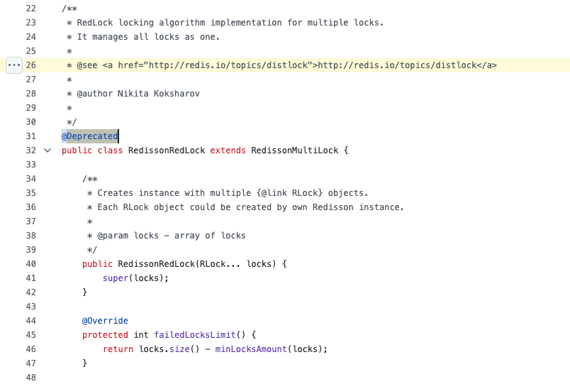

# ✅Redisson 中为什么要废弃 RedLock，该用啥？

# 典型回答

[✅什么是RedLock，他解决了什么问题？](https://www.yuque.com/hollis666/oolnrs/lxzg0ubs2xpvenxw)

RedLock 算法是一种基于 Redis 实现的分布式锁的方法，主要用来解决 Redis 的单点问题，详细算法细节见上文。

在我们常用的 Redisson 中是支持 RedLock 的，但是在后续的版本中已经被废弃（Deprecated）了：

[https://github.com/redisson/redisson/blob/master/redisson/src/main/java/org/redisson/RedissonRedLock.java#L26](https://github.com/redisson/redisson/blob/master/redisson/src/main/java/org/redisson/RedissonRedLock.java#L26)

导致 Redisson 废弃 RedLock ，可能有以下几个原因：

1. **缺乏官方认证**：尽管 RedLock 算法由 Redis 的创始人提出的，他后来指出，这种算法并没有经过彻底的检验，并且他不推荐在需要严格一致性的分布式系统中使用它。
2. **安全性和可靠性的担忧**：在某些情况下，RedLock 算法可能无法保证互斥性，特别是在网络分区和节点故障的情况下。这种不确定性可能导致算法在分布式环境中的锁定行为不是完全可靠的。
3. **维护和操作复杂性**：实现和维护 RedLock 需要对多个 Redis 实例进行操作，这不仅增加了部署的复杂性，也增加了出错的可能性。
4. **Martin Kleppmann 的批评**：分布式系统领域的知名研究者和作者Martin Kleppmann ，在他的分析中指出，RedLock 算法存在几个关键问题，可能导致它在某些故障模式下不能正确地提供锁服务。

当然，以上只是一些猜测，主要其实就是官方不认可，并且作者表示也不承担责任，所以在 Redisson 这种框架中就不再支持他了。

### 替代方案

那么，在 RedLock 不再被建议使用之后，到底有什么方案来解决这种集群中的一致性问题导致的重复加锁呢？

这个在业内并没有公认的方案。在实践中，可以有以下几个方案：

1、这个方案我说出来可能会被喷，但是还是要提一下，因为他确实有效。那就是使用单实例的 Redis 锁，虽然这样的方案会面临单点故障的问题，但是在一些可以容忍短暂的服务中断的场景，用的还是比较多的。

2、还是用普通的锁，如 SETNX、redisson 等，但是在业务逻辑中做好幂等控制及状态及校验（比如数据库的唯一性约束），以及各种对账。这样就可以避免真的出现因为Redis 的集群一致性出现问题导致重复加锁时，导致业务出现问题。主要业务没问题，其实就不算问题了。

3、使用那种强一致性的组件来实现分布式锁，如 ZooKeeper、etcd 或 Consul，这些系统提供了更强大的一致性保证，适用于需要严格一致性的分布式应用。这些系统使用类似于 Raft 或 Paxos 的一致性算法来保证数据的一致性和分布式锁的安全性。

> 更新: 2025-07-21 22:11:24  
> 原文: <https://www.yuque.com/hollis666/oolnrs/fz545rxlub3czyg6>