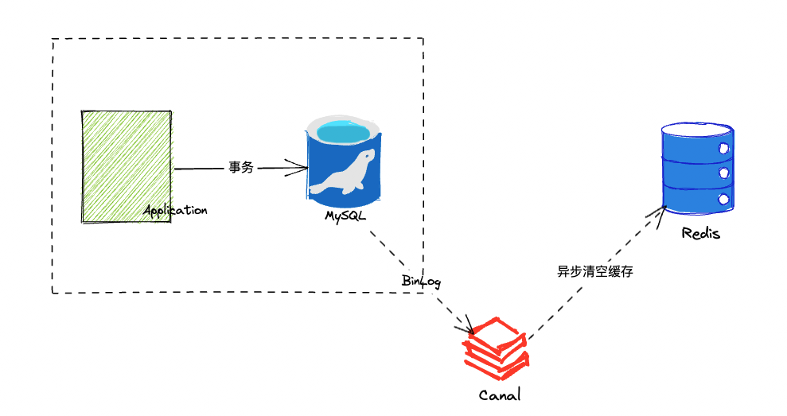

# ✅如何解决Redis和数据库的一致性问题？

# 典型回答
[✅什么情况下会出现数据库和缓存不一致的问题？](https://www.yuque.com/hollis666/oolnrs/xr0h8h)

为了保证Redis和数据库的数据一致性，肯定是要缓存和数据库双写了。

一般来说，在业内有3种比较常见的具体方案：

**1、先更新数据库， 再删除缓存。**

**2、延迟双删：先删除缓存，再更新数据库，再删除一次缓存**

**3、cache-aside：更新数据库，基于 binlog 监听进行缓存删除**

# 扩展知识

## 为什么删缓存而不是更新

为了保证数据库和缓存里面的数据是一致的，很多人会在做数据更新的时候，会同时更新缓存里面的内容。**但是我其实告诉大家，应该优先选择删除缓存而不是更新缓存。**

首先，我们暂时抛开数据一致性的问题，单独来看看更新缓存和删除缓存的复杂的问题。

我们放到缓存中的数据，很多时候可能不只是简单的一个字符串类型的值，他还可能是一个大的JSON串，一个map类型等等。

举个例子，我们需要通过缓存进行扣减库存的时候，你可能需要从缓存中查出整个订单模型数据，把他进行反序列化之后，再解析出其中的库存字段，把他修改掉，然后再序列化，最后再更新到缓存中。

可以看到，**更新缓存的动作，相比于直接删除缓存，操作过程比较的复杂，而且也容易出错。**

还有就是，在数据库和缓存的一致性保证方面，删除缓存相比更新缓存要更简单一点。

在"写写并发"的场景中，如果同时更新缓存和数据库，那么很容易会出现因为并发的问题导致数据不一致的情况。如：

先写数据库，再更新缓存

| W | W |
| --- | --- |
| 写数据库，更新成20 | |
| | 写数据库，更新成10 |
| | 写缓存，更新成10 |
| **写缓存，更新成20（数据不一致）** | |

先更新缓存，后写数据库：

| W | W |
| --- | --- |
| 写缓存，更新成20 | |
| | 写缓存，更新成10 |
| | 写数据库，更新成10 |
| **写数据库，更新成20（数据不一致）** | |

但是，**如果是做缓存的删除的话，在写写并发的情况下，缓存中的数据都是要被清除的，所以就不会出现数据不一致的问题。**

但是，删除缓存相比更新缓存还是有一个小的缺点，那就是带来的一次额外的cache miss，也就是说在删除缓存后的下一次查询会无法命中缓存，要查询一下数据库。

**这种cache miss在某种程度上可能会导致缓存击穿**，也就是刚好缓存被删除之后，同一个Key有大量的请求过来，导致缓存被击穿，大量请求访问到数据库。

但是，通过加锁的方式是可以比较方便的解决缓存击穿的问题的。

总之，删除缓存相比较更新缓存，方案更加简单，而且带来的一致性问题也更少。所以，在删除和更新缓存之间，我还是偏向于建议大家优先选择删除缓存。

## 先写数据库还是先删缓存

在确定了优先选择删除缓存而不是更新缓存之后，留给我们的数据库+缓存更新的可选方案就剩下："先写数据库后删除缓存"和"先删除缓存后写数据库了"。

那么，这两种方式各自有什么优缺点呢？该如何选择呢？

### 先删缓存

如果我们的是先删除缓存，再更新数据库，有一个好处，那就是：**如果是先删除缓存成功了，但是第二步更新数据库失败了，这种情况是可以接受的**，因为这样只是把缓存给清空了而已，但是不会有脏数据，也没什么影响，只需要重试就好了。

但是，**先删除缓存后写数据库的这种方式，会无形中放大"读写并发"导致的数据不一致的问题。**我们知道，当我们使用了缓存之后，一个读的线程在查询数据的过程是这样的：

**1、查询缓存，如果缓存中有值，则直接返回 **

**2、查询数据库 **

**3、把数据库的查询结果更新到缓存中**

**所以，****对于一个读线程来说，虽然不会写数据库，但是是会更新缓存的****，所以，在一些特殊的并发场景中，就会导致数据不一致的情况。**

**读写并发的时序如下：**

| W | R |
| :---: | --- |
| 删除缓存 |  |
|  | 读缓存，缓存中没有值 |
|  | 读数据库，数据库中得到结果为10 |
| 更新数据库，更新成20 | |
| | **写缓存，更新成10（数据不一致）** |

****

**也就是说，假如一个读线程，在读缓存的时候没查到值，他就会去数据库中查询，但是如果自查询到结果之后，更新缓存之前，数据库被更新了，但是这个读线程是完全不知道的，那么就导致最终缓存会被重新用一个"旧值"覆盖掉。**

**这也就导致了****缓存和数据库的不一致的现象****。**

但是这种现象其实发生的概率比较低，因为一般一个读操作是很快的，数据库+缓存的读操作基本在十几毫秒左右就可以完成了。**而在这期间，刚好另一个线程执行了一个比较耗时的写操作的概率确实比较低。**

因为这种"读写并发"问题发生的前提是读线程读缓存没读到值，而先删缓存的动作一旦发生，刚好可以让读线程就从缓存中读不到值。

所以，本来一个小概率会发生的"读写并发"问题，在先删缓存的过程中，问题发生的概率会被放大。

而且这种问题的后果也比较严重，那就是缓存中的值一直是错的，就会导致后续的所有命中缓存的查询结果都是错的！

### 先写数据库

如果我们先更新数据库，再删除缓存，有一个好处，那就是**缓存删除失败的概率还是比较低的**，除非是网络问题或者缓存服务器宕机的问题，否则大部分情况都是可以成功的。

并且这个方案还有一个好处，那就是数据库是作为持久层存储的，先更新数据库就能确保数据先写入持久层可以保证数据的可靠性和一致性，即使在删除缓存失败的情况下，数据库中已有最新数据。

但是这个方案也存在一个问题，那就是先写数据库，后删除缓存，如果第二步失败了，会导致数据库中的数据已经更新，但是缓存还是旧数据，**导致数据不一致**。

那么怎么解决呢？

### 延迟双删

[✅为什么需要延迟双删，两次删除的原因是什么？](https://www.yuque.com/hollis666/oolnrs/uswtlzlot2lcvy10)

## 如何选择

前面介绍了几种情况的具体问题和解决方案，那么实际工作中应该如何选择呢？

我觉得主要还是根据实际的业务情况来分析。

比如，如果业务量不大，并发不高的情况，可以选择**先更新数据库**，后删除缓存的方式，因为这种方案更加简单。

但是，如果是业务量比较大，并发度很高的话，那么建议选择**先删除缓存**，因为这种方式在引入延迟双删、分布式锁等机制会，会使得整个方案会更加趋近于完美，带来的并发问题更少。当然，也会更复杂。

其实，先操作数据库，后操作缓存，是一种比较典型的设计模式——**Cache Aside Pattern**。

这种模式的主要方案就是先写数据库，后删缓存，而且缓存的删除是可以在旁路异步执行的。

这种模式的优点就是我们说的，他可以解决"写写并发"导致的数据不一致问题，并且可以大大降低"读写并发"的问题，所以这也是Facebook比较推崇的一种模式。

## 优化方案

Cache Aside Pattern 这种模式中，我们可以异步的在旁路处理缓存。其实这种方案在大厂中确实有的还蛮多的。

主要的方式就是借助数据库的binlog或者基于异步消息订阅的方式。

也就是说，在代码的主要逻辑中，先操作数据库就行了，然后数据库操作完，可以发一个异步消息出来。

然后再由一个监听者在接到消息之后，异步的把缓存中的数据删除掉。

或者干脆借助数据库的binlog，订阅到数据库变更之后，异步的清除缓存。

这两种方式都会有一定的延时，通常在毫秒级别，一般用于在可接受秒级延迟的业务场景中。

> 这个方案为啥可以不做延迟双删，因为我们认为基于Binlog的监听是相对可靠的，监听到binlog之后就不断的重试进行删除。而通过写代码去删除缓存是不一定可靠的，因为这个重试机制并不一定可靠。
>
> 当然，如果要更加完美一点，肯定还是：
>
> 1、先删缓存
>
> 2、再更新数据
>
> 3、再监听binlog删除缓存
>

## 缓存更新的设计模式

前面介绍过了Cache Aside Pattern这种关于缓存操作的设计模式，那么其实还有几种其他的设计模式，也一起展开介绍一下：

### Read/Write Through Pattern

在这两种模式中，应用程序将缓存作为主要的数据源，不需要感知数据库，更新数据库和从数据库的读取的任务都交给缓存来代理。

**Read Through模式下**，是由缓存配置一个读模块，它知道如何将数据库中的数据写入缓存。在数据被请求的时候，如果未命中，则将数据从数据库载入缓存。

**Write Through模式下**，缓存配置一个写模块，它知道如何将数据写入数据库。当应用要写入数据时，缓存会先存储数据，并调用写模块将数据写入数据库。

也就是说，这两种模式下，不需要应用自己去操作数据库，缓存自己就把活干完了。

### Write Behind Caching Pattern

这种模式就是在更新数据的时候，只更新缓存，而不更新数据库，然后再异步的定时把缓存中的数据持久化到数据库中。

这种模式的优缺点比较明显，那就是读写速度都很快，但是会造成一定的数据丢失。

这种比较适合用在比如统计文章的访问量、点赞等场景中，允许数据少量丢失，但是速度要快。

## 没有银弹

《人月神话》的作者Fred Brooks在早年有一篇很著名文章《No Silver Bullet》 ，他提到：

> 在软件开发过程里是没有万能的终杀性武器的，只有各种方法综合运用，才是解决之道。而各种声称如何如何神奇的理论或方法，都不是能杀死“软件危机”这头人狼的银弹。
>

也就是说，没有哪种技术手段或者方案，是放之四海皆准的。如果有的话，我们这些工程师也就没有存在的必要了。

所以，任何的技术方案，都是一个权衡的过程，要权衡的问题有很多，业务的具体情况，实现的复杂度、实现的成本，团队成员的接受度、可维护性、容易理解的程度等等。

所以，没有一个"完美"的方案，只有"适合"的方案。

但是，如何能选出一个适合的方案，这里面就需要有很多的输入来做支撑了。希望本文的内容可以为你日后的决策提供一点参考！

> 更新: 2025-07-21 22:11:00  
> 原文: <https://www.yuque.com/hollis666/oolnrs/tmcgo0>