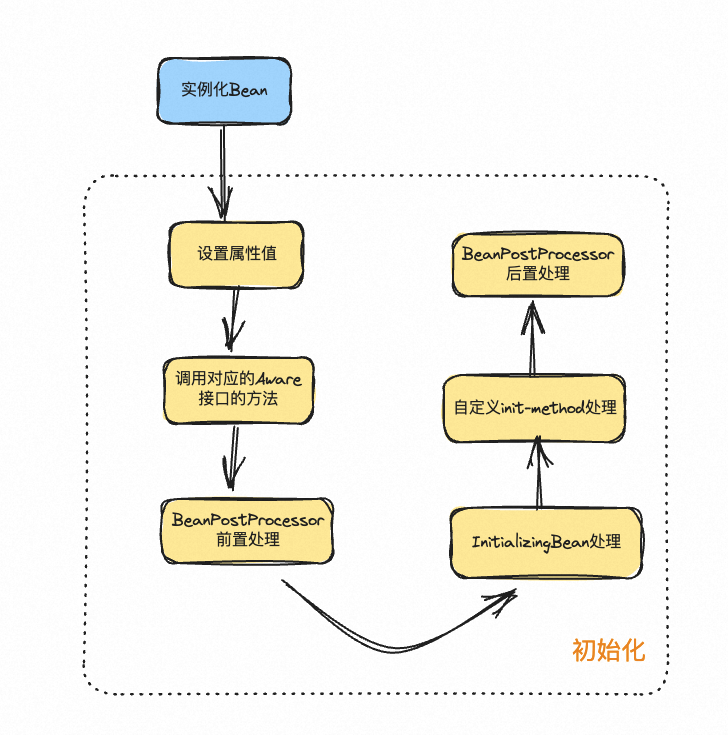

# ✅Spring Bean的初始化过程是怎么样的？

# 典型回答
[✅Spring Bean的生命周期是怎么样的？](https://www.yuque.com/hollis666/oolnrs/gpl60ga0c996vmw3)


先看过上面这篇，我们就能知道，Spring的可以分为5个小的阶段：实例化、初始化、注册Destruction回调、Bean的正常使用以及Bean的销毁。


我们再把初始化的这个过程单独拿出来展开介绍一下。（本文代码基于 Spring 6.0版本）





首先先看一下初始化和实例化的区别是什么？


在Spring框架中，初始化和实例化是两个不同的概念：

**实例化（Instantiation）**：

+ 实例化是创建对象的过程。在Spring中，这通常指的是通过调用类的构造器来创建Bean的实例。这是对象生命周期的开始阶段。对应doCreateBean中的createBeanInstance方法。

**初始化（Initialization）：**

+ 初始化是在Bean实例创建后，进行一些设置或准备工作的过程。在Spring中，包括设置Bean的属性，调用各种前置&后置处理器。对应doCreateBean中的populateBean和initializeBean方法。


下面是SpringBean的实例化+初始化的完整过程：  


### 实例化Bean
Spring容器在这一步创建Bean实例。其主要代码在AbstractAutowireCapableBeanFactory类中的createBeanInstance方法中实现：


```java
protected BeanWrapper createBeanInstance(String beanName, RootBeanDefinition mbd, Object[] args) {
    // 解析Bean的类，确保Bean的类在这个点已经被确定
    Class<?> beanClass = resolveBeanClass(mbd, beanName);

    // 检查Bean的访问权限，确保非public类允许访问
    if (beanClass != null && !Modifier.isPublic(beanClass.getModifiers()) && !mbd.isNonPublicAccessAllowed()) {
        throw new BeanCreationException(mbd.getResourceDescription(), beanName,
                "Bean class isn't public, and non-public access not allowed: " + beanClass.getName());
    }

    // 如果Bean定义中指定了工厂方法，则通过工厂方法创建Bean实例
    if (mbd.getFactoryMethodName() != null) {
        return instantiateUsingFactoryMethod(beanName, mbd, args);
    }

    // 当重新创建相同的Bean时的快捷路径
    boolean resolved = false;
    boolean autowireNecessary = false;
    if (args == null) {
        synchronized (mbd.constructorArgumentLock) {
            // 如果构造方法或工厂方法已经被解析，直接使用解析结果
            if (mbd.resolvedConstructorOrFactoryMethod != null) {
                resolved = true;
                autowireNecessary = mbd.constructorArgumentsResolved;
            }
        }
    }
    if (resolved) {
        // 如果需要自动装配构造函数参数，则调用相应方法进行处理
        if (autowireNecessary) {
            return autowireConstructor(beanName, mbd, null, null);
        }
        else {
            // 否则使用无参构造函数或默认构造方法创建实例
            return instantiateBean(beanName, mbd);
        }
    }

    // 通过BeanPostProcessors确定构造函数候选
    Constructor<?>[] ctors = determineConstructorsFromBeanPostProcessors(beanClass, beanName);
    // 如果有合适的构造函数或需要通过构造函数自动装配，则使用相应的构造函数创建实例
    if (ctors != null || mbd.getResolvedAutowireMode() == AUTOWIRE_CONSTRUCTOR ||
            mbd.hasConstructorArgumentValues() || !ObjectUtils.isEmpty(args)) {
        return autowireConstructor(beanName, mbd, ctors, args);
    }

    // 没有特殊处理，使用默认的无参构造函数创建Bean实例
    return instantiateBean(beanName, mbd);
}

```


其实就是先确保这个Bean对应的类已经被加载，然后确保它是public的，然后如果有工厂方法，则直接调用工厂方法创建这个Bean，如果没有的话就调用它的构造方法来创建这个Bean。


这里需要注意的是，在Spring的完整Bean创建和初始化流程中，容器会在调用createBeanInstance之前检查Bean定义的作用域。如果是Singleton，容器会在其内部单例缓存中查找现有实例。如果实例已存在，它将被重用；如果不存在，才会调用createBeanInstance来创建新的实例。


```java
BeanWrapper instanceWrapper = null;
if (mbd.isSingleton()) {
    instanceWrapper = this.factoryBeanInstanceCache.remove(beanName);
}
if (instanceWrapper == null) {
    instanceWrapper = createBeanInstance(beanName, mbd, args);
}
```


下一步就应该要到设置属性值了，但是在这之前还有一个重要的东西要讲，那就是三级解决循环依赖，在doCreateBean方法中：


```java
protected Object doCreateBean(final String beanName, final RootBeanDefinition mbd, final Object[] args)
			throws BeanCreationException {

		// 实例化bean
		// ...

        // Eagerly cache singletons to be able to resolve circular references
		// even when triggered by lifecycle interfaces like BeanFactoryAware.
		boolean earlySingletonExposure = (mbd.isSingleton() && this.allowCircularReferences &&
				isSingletonCurrentlyInCreation(beanName));
		if (earlySingletonExposure) {
			if (logger.isDebugEnabled()) {
				logger.debug("Eagerly caching bean '" + beanName +
						"' to allow for resolving potential circular references");
			}
			addSingletonFactory(beanName, new ObjectFactory<Object>() {
				@Override
				public Object getObject() throws BeansException {
					return getEarlyBeanReference(beanName, mbd, bean);
				}
			});
		}

        // ...

		
        //设置属性值
		//初始化Bean

    	// ...

		// 注册Bean的销毁回调

		return exposedObject;
	}
```


这部分就是关于三级缓存解决循环依赖的内容。


[✅Spring解决循环依赖一定需要三级缓存吗？](https://www.yuque.com/hollis666/oolnrs/edvhrik3pbw300os)


### **设置属性值**


populateBean方法是Spring Bean生命周期中的一个关键部分，负责将属性值应用到新创建的Bean实例。它处理了自动装配、属性注入、依赖检查等多个方面。代码如下：


```java
protected void populateBean(String beanName, RootBeanDefinition mbd, BeanWrapper bw) {
    // 获取Bean定义中的属性值
    PropertyValues pvs = mbd.getPropertyValues();

    // 如果BeanWrapper为空，则无法设置属性值
    if (bw == null) {
        if (!pvs.isEmpty()) {
            throw new BeanCreationException(
                    mbd.getResourceDescription(), beanName, "Cannot apply property values to null instance");
        }
        else {
            // 对于null实例，跳过设置属性阶段
            return;
        }
    }

    // 在设置属性之前，给InstantiationAwareBeanPostProcessors机会修改Bean状态
    // 这可以用于支持字段注入等样式
    boolean continueWithPropertyPopulation = true;

    // 如果Bean不是合成的，并且存在InstantiationAwareBeanPostProcessor，执行后续处理
    if (!mbd.isSynthetic() && hasInstantiationAwareBeanPostProcessors()) {
        for (BeanPostProcessor bp : getBeanPostProcessors()) {
            if (bp instanceof InstantiationAwareBeanPostProcessor) {
                InstantiationAwareBeanPostProcessor ibp = (InstantiationAwareBeanPostProcessor) bp;
                if (!ibp.postProcessAfterInstantiation(bw.getWrappedInstance(), beanName)) {
                    continueWithPropertyPopulation = false;
                    break;
                }
            }
        }
    }

    // 如果上述处理后决定不继续，则返回
    if (!continueWithPropertyPopulation) {
        return;
    }

    // 根据自动装配模式（按名称或类型），设置相关的属性值
    if (mbd.getResolvedAutowireMode() == RootBeanDefinition.AUTOWIRE_BY_NAME ||
            mbd.getResolvedAutowireMode() == RootBeanDefinition.AUTOWIRE_BY_TYPE) {
        MutablePropertyValues newPvs = new MutablePropertyValues(pvs);

        // 如果是按名称自动装配，添加相应的属性值
        if (mbd.getResolvedAutowireMode() == RootBeanDefinition.AUTOWIRE_BY_NAME) {
            autowireByName(beanName, mbd, bw, newPvs);
        }

        // 如果是按类型自动装配，添加相应的属性值
        if (mbd.getResolvedAutowireMode() == RootBeanDefinition.AUTOWIRE_BY_TYPE) {
            autowireByType(beanName, mbd, bw, newPvs);
        }

        pvs = newPvs;
    }

    // 检查是否需要进行依赖性检查
    boolean hasInstAwareBpps = hasInstantiationAwareBeanPostProcessors();
    boolean needsDepCheck = (mbd.getDependencyCheck() != RootBeanDefinition.DEPENDENCY_CHECK_NONE);

    // 如果需要，则进行依赖性检查
    if (hasInstAwareBpps || needsDepCheck) {
        PropertyDescriptor[] filteredPds = filterPropertyDescriptorsForDependencyCheck(bw, mbd.allowCaching);
        if (hasInstAwareBpps) {
            for (BeanPostProcessor bp : getBeanPostProcessors()) {
                if (bp instanceof InstantiationAwareBeanPostProcessor) {
                    InstantiationAwareBeanPostProcessor ibp = (InstantiationAwareBeanPostProcessor) bp;
                    pvs = ibp.postProcessPropertyValues(pvs, filteredPds, bw.getWrappedInstance(), beanName);
                    if (pvs == null) {
                        return;
                    }
                }
            }
        }
        if (needsDepCheck) {
            checkDependencies(beanName, mbd, filteredPds, pvs);
        }
    }

    // 应用属性值
    applyPropertyValues(beanName, mbd, bw, pvs);
}

```


逻辑也比较清晰，就是把各种属性进行初始化。


### initializeBean方法


这个方法是初始化中的关键方法，后面要介绍的几个步骤就在这个方法中编排的：

```java
protected Object initializeBean(final String beanName, final Object bean, RootBeanDefinition mbd) {

    //...
    //检查Aware
    invokeAwareMethods(beanName, bean);
    
	//调用BeanPostProcessor的前置处理方法
    Object wrappedBean = bean;
    if (mbd == null || !mbd.isSynthetic()) {
        wrappedBean = applyBeanPostProcessorsBeforeInitialization(wrappedBean, beanName);
    }

    //调用InitializingBean的afterPropertiesSet方法或自定义的初始化方法及自定义init-method方法
    try {
        invokeInitMethods(beanName, wrappedBean, mbd);
    }
    catch (Throwable ex) {
        throw new BeanCreationException(
                (mbd != null ? mbd.getResourceDescription() : null),
                beanName, "Invocation of init method failed", ex);
    }
    //调用BeanPostProcessor的后置处理方法
    if (mbd == null || !mbd.isSynthetic()) {
        wrappedBean = applyBeanPostProcessorsAfterInitialization(wrappedBean, beanName);
    }
    return wrappedBean;
}
```


### **检查Aware**


```java
private void invokeAwareMethods(final String beanName, final Object bean) {
    if (bean instanceof Aware) {
        if (bean instanceof BeanNameAware) {
            ((BeanNameAware) bean).setBeanName(beanName);
        }
        if (bean instanceof BeanClassLoaderAware) {
            ((BeanClassLoaderAware) bean).setBeanClassLoader(getBeanClassLoader());
        }
        if (bean instanceof BeanFactoryAware) {
            ((BeanFactoryAware) bean).setBeanFactory(AbstractAutowireCapableBeanFactory.this);
        }
    }
}
```


就是检查这个Bean是不是实现了BeanNameAware、BeanClassLoaderAware等这些Aware接口，Spring容器会调用它们的方法进行处理。


这些Aware接口提供了一种机制，使得Bean可以与Spring框架的内部组件交互，从而更灵活地利用Spring框架提供的功能。


+ BeanNameAware: 通过这个接口，Bean可以获取到自己在Spring容器中的名字。这对于需要根据Bean的名称进行某些操作的场景很有用。
+ BeanClassLoaderAware: 这个接口使Bean能够访问加载它的类加载器。这在需要进行类加载操作时特别有用，例如动态加载类。
+ BeanFactoryAware：通过这个接口可以获取对 BeanFactory 的引用，获得对 BeanFactory 的访问权限

  


### 调用BeanPostProcessor的前置处理方法


BeanPostProcessor是Spring IOC容器给我们提供的一个扩展接口，他的主要作用主要是帮我们在Bean的初始化前后添加一些自己的逻辑处理，Spring内置了很多BeanPostProcessor，我们也可以定义一个或者多个 BeanPostProcessor 接口的实现，然后注册到容器中。


调用BeanPostProcessor的前置处理方法是在applyBeanPostProcessorsBeforeInitialization这个方法中实现的，代码如下：


```java
@Override
public Object applyBeanPostProcessorsBeforeInitialization(Object existingBean, String beanName)
        throws BeansException {

    Object result = existingBean;
    for (BeanPostProcessor processor : getBeanPostProcessors()) {
        result = processor.postProcessBeforeInitialization(result, beanName);
        if (result == null) {
            return result;
        }
    }
    return result;
}
```


其实就是遍历所有的BeanPostProcessor的实现，执行他的postProcessBeforeInitialization方法。


### **调用InitializingBean的afterPropertiesSet方法或自定义的初始化方法**


[✅@PostConstruct、init-method和afterPropertiesSet执行顺序](https://www.yuque.com/hollis666/oolnrs/sgf2ipp88i6qk803)


### **调用BeanPostProcessor的后置处理方法**


调用BeanPostProcessor的后置处理方法是在applyBeanPostProcessorsAfterInitialization这个方法中实现的，代码如下：


```java
@Override
public Object applyBeanPostProcessorsAfterInitialization(Object existingBean, String beanName)
        throws BeansException {

    Object result = existingBean;
    for (BeanPostProcessor processor : getBeanPostProcessors()) {
        result = processor.postProcessAfterInitialization(result, beanName);
        if (result == null) {
            return result;
        }
    }
    return result;
}

```


其实就是遍历所有的BeanPostProcessor的实现，执行他的postProcessAfterInitialization方法。


这里面需要我们关注的就是**AnnotationAwareAspectJAutoProxyCreator（继承自AspectJAwareAdvisorAutoProxyCreator），**他们也是BeanPostProcessor的实现，他之所以重要，是因为在他的postProcessAfterInitialization 后置处理方法。



```java
/**
 * Create a proxy with the configured interceptors if the bean is
 * identified as one to proxy by the subclass.
 * @see #getAdvicesAndAdvisorsForBean
 */
@Override
public Object postProcessAfterInitialization(Object bean, String beanName) throws BeansException {
    if (bean != null) {
        Object cacheKey = getCacheKey(bean.getClass(), beanName);
        if (this.earlyProxyReferences.remove(cacheKey) != bean) {
            return wrapIfNecessary(bean, beanName, cacheKey);
        }
    }
    return bean;
}

```


在这里完成AOP的代理的创建。


[✅介绍一下Spring的AOP](https://www.yuque.com/hollis666/oolnrs/nget4r5wl2imegi7)


> 更新: 2025-07-21 22:11:42  
> 原文: <https://www.yuque.com/hollis666/oolnrs/zlvhpz>