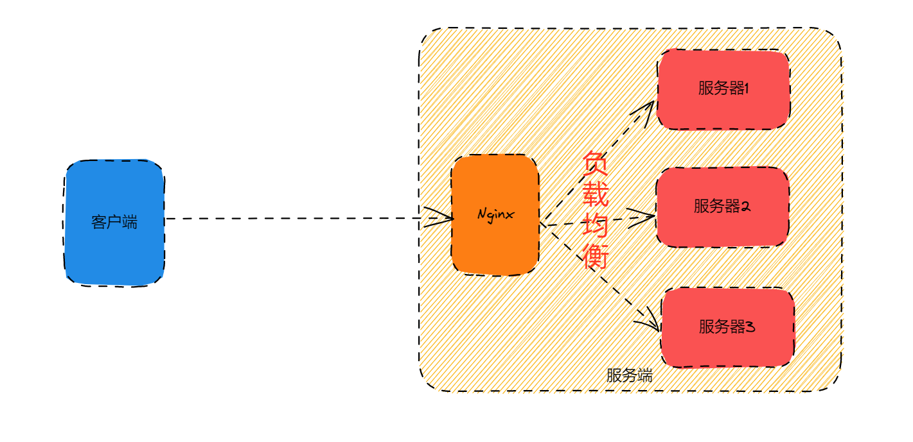
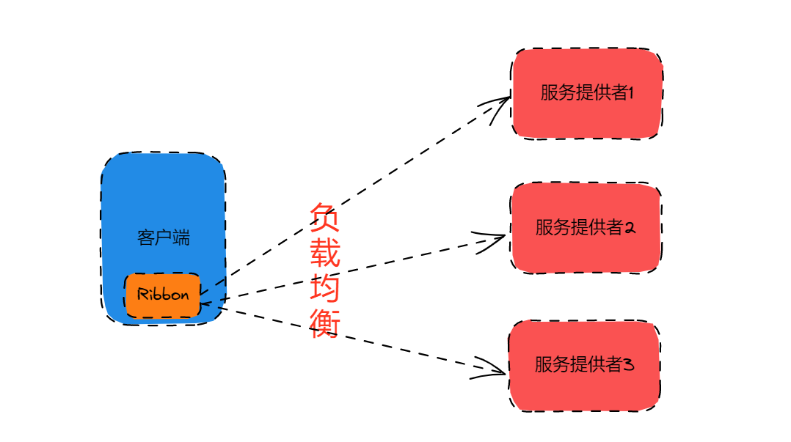

# ✅Ribbon和Nginx的区别是什么？

# 典型回答

当我们在在对比Ribbon（包括loadbalancer）和Nginx的时候，主要对比的是他们的负载均衡方面的区别。

**这两者最主要的区别是Nginx是一种服务端负载均衡的解决方案，而Ribbon是一种客户端负载均衡的解决方案。**

服务端负载均衡指的是将负载均衡的逻辑集成到服务提供端，通过在服务端对请求进行转发，实现负载均衡。

所以Nginx还是一个反向代理服务器，因为他做的是服务端负载均衡。

客户端负载均衡指的是将负载均衡的逻辑集成到服务消费端的代码中，在客户端直接选择需要调用的服务提供端，并发起请求。这样的好处是可以在客户端直接实现负载均衡、容错等功能，不需要依赖其他组件，使得客户端具有更高的灵活性和可控性。

Nginx是需要单独部署一个Nginx服务的，这样他才能做好服务端负载均衡，而Ribbon是需要在服务消费端的机器代码中引入，和应用部署在一起，这样他才能实现客户端的负载均衡。

  
 

> 更新: 2025-07-21 22:11:25  
> 原文: <https://www.yuque.com/hollis666/oolnrs/mr3ozrbq3ur2f1la>