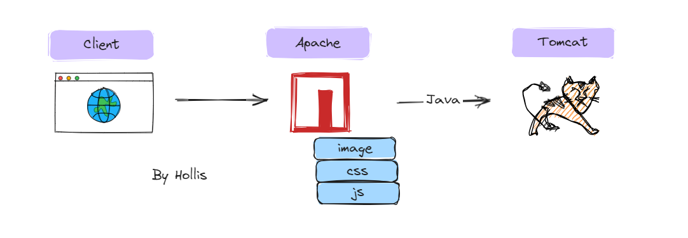

# ✅Tomcat与Web服务器（如Apache）之间的关系是什么？

# 典型回答

Tomcat是一个开源的**Java Servlet容器**和**JavaServer Pages（JSP）引擎**，Tomcat是一个Web应用程序服务器，它实现了Java Servlet和JSP规范，支持Java的Server-Side编程模型。它提供了一个Servlet容器，用于管理和执行Java Servlet，以及一个JSP引擎，用于编译和执行JSP页面。

**Tomcat与Web服务器（如Apache、Nginx等）之间通常是配合使用的，形成一个典型的应用服务器架构。**这种架构被称为"Tomcat-Apache联合部署"，它利用了两者的优势，提供更强大的功能和性能。

这种情况下，Apache充当反向代理服务器，负责接收客户端的请求并处理一部分静态内容的请求。然后，Apache将动态请求（如Java Servlet、JSP）转发给Tomcat进行处理。Apache与Tomcat之间的通信通常通过AJP协议（Apache JServ Protocol）或HTTP协议来实现。并且Apache也可以处理一些简单的操作，比如静态资源的访问，黑名单控制等。

这种架构的优势是，Apache作为前端服务器能够处理高并发的静态请求，而Tomcat作为应用服务器则专注于处理动态请求，提供Java Servlet和JSP的支持。这样分离静态和动态内容，使得整体的请求处理效率更高。

> 更新: 2025-07-21 22:10:34  
> 原文: <https://www.yuque.com/hollis666/oolnrs/yan30bxgibygubcx>