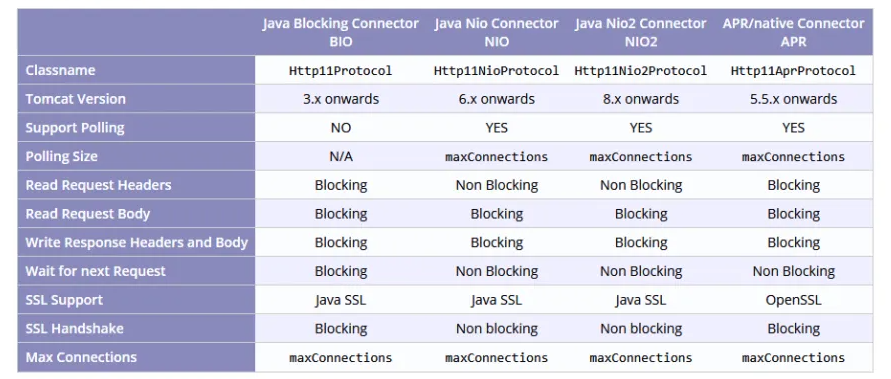

# ✅介绍一下Tomcat的IO模型？

# 典型回答


关于Tomcat的IO模型，不同的版本中是不太一样的，下面是一张Tomcat官网中各个历史重要版本所采用IO模型的介绍：





综合来说就是Tomcat支持多种IO模型，包括了标准的BIO（Blocking I/O）、NIO（Non-Blocking I/O）、NIO2（即JDK 1.7中的AIO）和APR（Apache Portable Runtime）。


+ **BIO**是最传统的线程模型，也称为阻塞I/O。在BIO模型中，每个客户端连接都由一个独立的线程处理。当有新的连接到来时，Tomcat会创建一个新的线程来处理请求。这意味着每个连接都需要一个独立的线程，当并发连接数较大时，会导致线程数急剧增加，占用大量系统资源，并且可能出现线程切换带来的开销。
+ **NIO**是Java的新I/O库（java.nio）的线程模型。在NIO模型中，通过使用Java NIO的选择器（Selector）机制，一个线程可以同时处理多个连接的请求。NIO模型相对于BIO模型来说，能够支持更多的并发连接，并且在连接数较大时对系统资源的消耗较少，但由于在应用层需要处理I/O事件，编程较为复杂。
+ **NIO2**是Java 7引入的进一步改进的NIO模型，也叫AIO。在NIO2中，Java提供了更多的异步I/O操作，包括异步文件I/O、异步套接字I/O等。这使得Tomcat能够更好地支持异步请求处理，提高了处理性能和效率。
+ **APR**是Apache软件基金会提供的一个库，它为应用程序提供了跨平台的抽象层，提供了高性能的本地I/O支持。在APR模型中，Tomcat利用本地操作系统的特性进行I/O操作，包括网络和文件I/O。APR模型在性能方面表现得非常出色，特别是在处理大量并发连接时，因为它直接利用底层操作系统的异步I/O能力。


我们可以在Tomcat启动的时候，可以通过log看到Connector使用的是哪一种运行模式：


```plain
Starting ProtocolHandler [“http-bio-8080”]
Starting ProtocolHandler [“http-nio-8080”]
Starting ProtocolHandler [“http-apr-8080”]
```


# 扩展知识


## 如何切换


切换Tomcat使用的I/O模型通常涉及配置Tomcat的连接器（Connector）。不同的I/O模型对应着不同的连接器实现。


在server.xml文件中，通过配置Connecter来选择不同的IO模型，如：


```plain
<Connector port="8080" protocol="HTTP/1.1"
           connectionTimeout="20000"
           redirectPort="8443" />
```


这里的protocol就是可以修改来替换成其他的协议，即IO模型的地方。


各个IO模型对应的关系如下：


+ BIO模型：将protocol属性设置为HTTP/1.1（默认值），或者可以显式地设置为org.apache.coyote.http11.Http11Protocol。
+ NIO模型：将protocol属性设置为org.apache.coyote.http11.Http11NioProtocol。
+ NIO2模型：将protocol属性设置为org.apache.coyote.http11.Http11Nio2Protocol。
+ APR模型：将protocol属性设置为org.apache.coyote.http11.Http11AprProtocol。


但是记得修改后需要重启tomcat才会生效。而且需要注意，Tomcat的不同版本可能支持不同的I/O模型，因此请根据您使用的Tomcat版本进行相应的配置。


一般来说，建议使用NIO或者NIO2就行了，对于涉及大量I/O操作的应用，例如Web服务、聊天应用或在线游戏等，NIO或NIO2模型都挺合适。


如果对性能要求非常高，可以考虑使用APR模型，但需要安装和配置APR库，有一定的成本。


> 更新: 2025-07-21 22:10:33  
> 原文: <https://www.yuque.com/hollis666/oolnrs/xui1w5fui7epgthh>