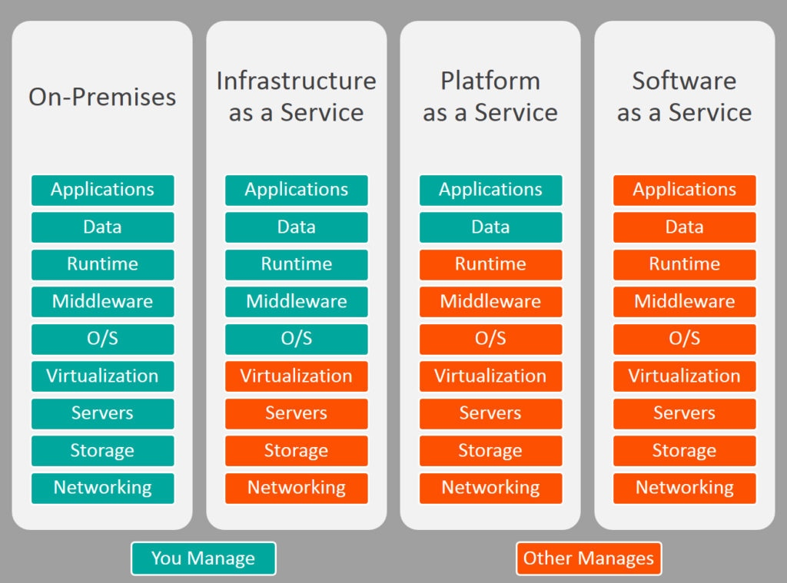

# ✅什么是IaaS、PaaS、SaaS？

# 典型回答

IaaS（Infrastructure as a Service），即基础设施即服务。指把IT基础设施作为一种服务通过网络对外提供，并根据用户对资源的实际使用量或占用量进行计费的一种服务模式。

PaaS（Platform as a Service），是指平台即服务。 是一种云计算服务，提供运算平台与解决方案服务。

SaaS（Software-as-a-Service），意思为软件即服务，即通过网络提供软件服务。

## 举例说明三者区别

**IaaS ：共享厨房服务**

****

商家为用户提供了厨房、锅具、煤气灶、烤箱、电饭煲等等一系列厨房用品。用户需要自己购买米、面、蔬菜、调味品等，并进行加工制作。

有了IaaS服务，用户可以在云服务提供商提供的基础设施上部署和运行任何软件，包括操作系统和应用软件。

用户没有权限管理和访问底层的基础设施，如服务器、交换机、硬盘等，但是有权管理操作系统、存储内容，可以安装管理应用程序，甚至是有权管理网络组件。

**PaaS ：共享厨房服务 + 预制菜**

餐厅除了提供厨房、厨具等，还提供了清洗干净切好的蔬菜、调好味道的肉、饺子皮和饺子馅等。用户要享受美食，首先需要炒菜、加热或者煮熟，但却不用做太多的前期多种复杂准备。

PaaS给用户提供的能力是使用由云服务提供商支持的编程语言、库、服务以及开发工具来创建、开发应用程序并部署在相关的基础设施上。

用户无需管理底层的基础设施，包括网络、服务器，操作系统或者存储。他们只能控制部署在基础设施中操作系统上的应用程序，配置应用程序所托管的环境的可配置参数。

  
**SaaS：点外卖**

****

SaaS相当于餐厅直接为大家提供做好的菜肴，还提供外卖服务。用户只需要付费，就可以享受各种不同类型的美味佳肴，还可以在有外卖网点的地方直接点餐。

SaaS给用户提供的能力是使用在云基础架构上运行的云服务提供商的应用程序。可以通过轻量的客户端接口（诸如web浏览器（例如，基于web的电子邮件））或程序接口从各种客户端设备访问应用程序。

用户无需管理或控制底层云基础架构，包括网络，服务器，操作系统，存储甚至单独的应用程序功能，可能的例外是有限的用户特定应用程序配置设置。

> 更新: 2025-07-21 22:10:51  
> 原文: <https://www.yuque.com/hollis666/oolnrs/krggw3gqkn5fm6k7>