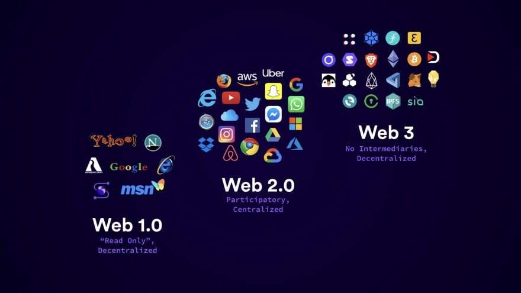
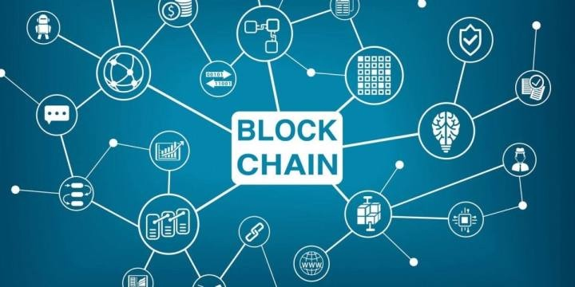
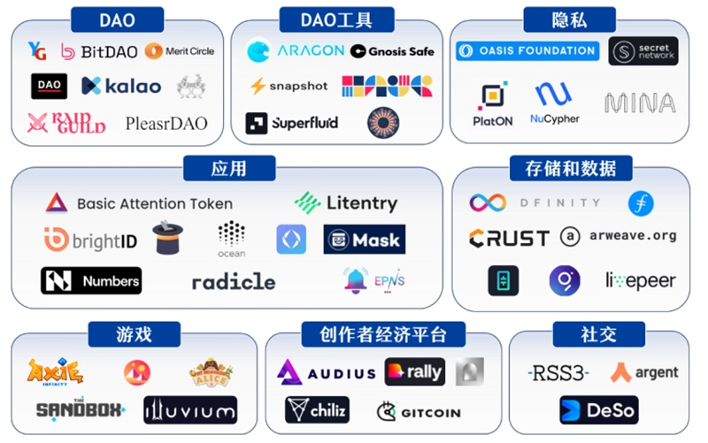
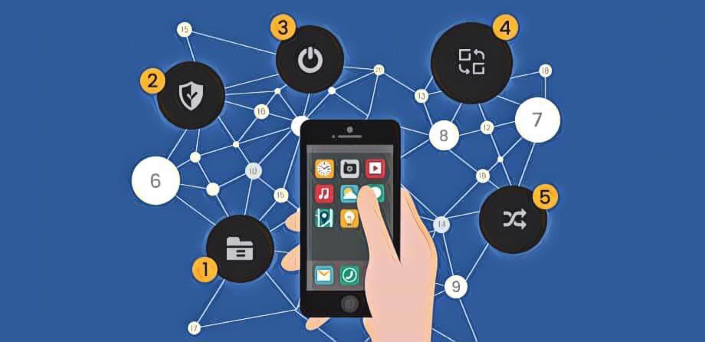

# ✅什么是Web 3.0？

Web 3.0是最近非常火的一个概念了，就算你不知道他具体是什么，但是你也一定听说过这个名词。

但是Web 3.0中又夹杂着很多其他的概念，比如币、DeFi、DeApps、NFT、元宇宙，等等更多其他的概念，所以很多人就更难理解了。这篇文章我们站在工程师的角度来谈一谈什么是Web 3.0，为什么他广受争议，他到底发展到什么阶段了，作为普通研发者，我们能在这里面做些什么呢？

## 第三代互联网
Web 3.0很多人把它称之为第三代互联网，那么他和前两代有什么区别呢？到底第三代做了啥事情呢？我们先了解下什么是 Web 1.0 和 Web 2.0。

### Web 1.0
一般认为2004年之前的互联网就处于Web 1.0的时代，那时候的网站主要是提供了一些查阅信息的功能，比如像搜狐这类新闻网站、雅虎这类搜索网站，以及马云在做阿里巴巴之前搞的中国黄页。

这些网站的主要特点就是他们主要是做信息展示的，也就是说上面的内容你只能看。

所以，Web 1.0是只读的。

### Web 2.0
那到了Web 2.0的时代之后呢，从2004年开始，很多互动式的网站、APP都接踵而至了，比如我们现在还常用的微信、抖音、FaceBook。

在这些Web 2.0的网站上面，你不仅能获取到很多信息，你还能参与进来做互动以及内容的产出。比如你可以做评论，发动态，发你的作品等等。

所以，Web 2.0是能读+写的。

### Web 3.0
那什么是Web 3.0呢，那就是很多人认为说虽然在Web 2.0的时代，我们作为用户输出了很多内容，但是这些内容的所有权并不属于我们，而是属于那些平台的。而这些平台网站，虽然他们背后的服务器部署、以及应用架构可能是做了各种分布式、异地多活、冷热备份什么的。但是，归根结底，如果这家公司倒闭了，那你的数据也都没有了。所以，他还是中心化的。

在Web 2.0的时代，用户生产了很多内容和数据，但是真正受益的是那些平台，他们可以利用我们的数据进行营销、广告，很多时候我们没有任何办法。

那于是，就有人提出了Web 3.0的概念，在这里面，用户不仅可以读、也可以写数据，最重要是用户可以拥有自己的数据。

也就是说，在Web 3.0中，我的数据不再属于任何中心化的平台、公司、或者机构，我的数据属于我自己。那么，怎么算数据属于我自己呢？

如果腾讯说，好的，我宣布你的朋友圈属于你自己，那就算了？那当然不是。

如何实现这个<属于>呢，这就需要用到区块链了。

### Web 3.0与区块链
Web 3.0中最重要的是用户拥有自己的数据，那么也就是说我们的数据不能存储在任何中心化的存储上。这时候就需要区块链这种去中心化的技术了。

所以，也有人说所谓的Web 3.0，其实就是运行在区块链技术上的去中心化互联网。

利用区块链技术，我们每一个人都可以是链上的一个节点，而且大家都是具有平等权利和义务的，不再需要一个中心，所有的上链的动作，不再需要中心处理节点、不需要数字证书、也不需要谁批准。所有参与的节点进行共识算法投票就行了。一旦经过确权，那就不可再更改了。

那么，其实区块链又分为公有链、私有链还有联盟链，大家想一想就不难理解，Web 3.0应该就是构建在公有链之上的。

## Web 3.0的实际应用
Web 3.0 是想建设去中心化的互联网，那么就主要需要依赖区块链的技术。那和Web 1.0和Web 2.0一样，在Web 3.0 里面肯定需要有很多网站、应用供我们使用才行，那这些应用也需要构建在区块链之上，否则也就不算Web 3.0了。

那么，在Web 3.0中，有自己的货币——加密货币、自己的组织形式——DAO、自己的服务模式——智能合约、自己的藏品——NFT、自己的金融——DeFi、自己的游戏——GameFi等等。。。

所以，我们常说的那些数字货币、NFT、游戏、甚至是元宇宙，其实都是Web 3.0这个底层基础架构上面的实际应用。这些东西综合到一起就组成了Web 3.0。

当然，这些应用当中有一个比较特殊，那就是数字货币，他不仅仅是Web 3.0中的一个实际应用，更重要的是它是维持Web 3.0的一个重要基础，为什么这么说呢，还记得我们前面讲过了说Web 3.0需要基于公有链来运行，那么公有链想要自主的良好运行，就需要有激励制度，要不然谁会愿意上来共同维护这个体系呢。那真的能起到激励作用的，那无非就是币了。

## Web 3.0的问题
说了这么多，相比大家对于Web 3.0 也有一点自己的理解了。好像听上去有点意思，但是为啥还是有很多人说他不靠谱的？为啥我们听到的和这东西有关的大部分都是负面新闻呢？

主要是Web 3.0目前的很多应用，无论是加密货币也好、NFT也好、智能合约也好，大多数被应用的场景还是在炒。炒着炒着就变成割了。

有了Web 3.0、元宇宙、数字货币等这么多高大上的概念之后，就可以开始讲故事了，只要这个故事有人信，就有人愿意参与进来。

话又说回来了，那你说参与进去的那些人是真的信吗？我觉得也未必，其中肯定有部分人就是抱着投机的心理进去的。想着自己可能肯定能在镰刀下来之前先走掉。

很多人之所以明知道有风险还愿意进去，主要是因为这东西大大的降低了投资的门槛。在以前，你想投资一个公司，那门槛还是很高的。但是现在呢，不管公司业务好不好，先讲个故事，发个代币，就能让大家开始投资了。。。

其次呢，Web 3.0还有一些技术上的问题至今突破不了的。

第一个，就是交易慢、资源浪费

因为Web 3.0是构建在公有链之上的，而目前的公有链上的共识算法，都非常的耗费资源，而且确认的速度也很慢。

第二个，就是没有了中心管理，那出了问题也没人管

如果你用支付宝交易，转错账了，还有可能联系对方看看能不能要回来。如果你遇到诈骗了，可能支付宝还能提醒你不要转账。如果你的钱放到支付宝无缘无故的丢了，你还能找支付宝去要。

那如果没有中心了，转错钱了就转错了，对方在真实世界中到底是谁你都不知道。这就给很多诈骗、勒索的等很多机会。

## 开发者能参与吗？
那很多人就会问，这东西现在这么火，作为普通开发者，我们能参与到里面来吗？

现在有很多开发者都在从事Web 3.0的一些开发，但是因为这东西涉及到的概念实在太多了，所以他涉及到的技术栈也比较多，主要涉及以下这些：

底层技术包含了共识算法、一致性协议、密码学技术、分布式存储、人工智能、大数据等。如果涉及到虚拟现实等游戏交互的话，可能还会涉及到动作捕捉、空间感知、数字孪生等相关技术。

目前，为了降低开发难度，很多人会采用DApp进行开发，他的全称是Decentralized Application，指的就是建立在区块链之上的应用程序。

关于DApp，现在也有许多流行的生态系统，比如 Ethereum、Gemini 和 Solana等等，目前基于DApp实现的应用也有很多了，涉及到交易所、游戏、金融、存储、钱包、治理、身份、社交、安全、能源、保险和健康等。

感兴趣的朋友可以自行了解一下。

  

> 更新: 2025-07-21 22:10:53  
> 原文: <https://www.yuque.com/hollis666/oolnrs/kv16ic14d29a4ik5>