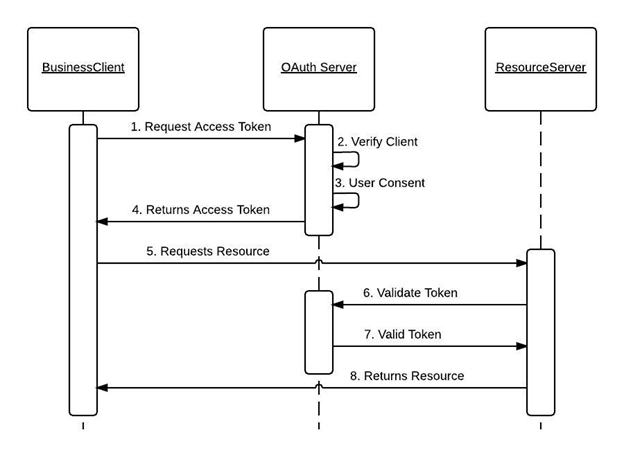

# ✅什么是OAuth2？有什么用？

# 典型回答
OAuth 2.0（OAuth2）是一种开放授权协议，它允许用户将有限的访问权限授权给第三方应用，而无需直接共享用户的凭据（如用户名和密码）。OAuth2 是目前最流行的授权框架之一，被广泛用于保护 API 和实现安全的访问控制。 以及单点登录的实现。

比如，我们可以通过 OAuth2 使用 微信、微博、QQ 等账号登录第三方应用，而不需要输入密码。  或者是我们可以用第三方应用来访问一些云端数据，如 Google Drive、Dropbox 。

下图是一个比较完成的OAuth2的流程，这里涉及到几个概念：

**客户端（Client）**：第三方应用程序，如浏览器、APP等，希望访问一些特定的数据。

**资源服务器（Resource Server）**：存储资源所有者的数据，并响应客户端的请求（如 API）。一般是指我们提供服务的后端服务器。

**授权服务器（OAuth Server）**：负责验证资源所有者的身份并颁发令牌（Access Token）。

大致流程就是客户端先向授权服务器请求权限，权限校验通过后向客户端颁发一个令牌，即Access Token

后续客户端再访问资源服务器的时候，只需要带上这个令牌，资源服务器会对Access Token做验证，验证通过后则进行数据返回。

OAuth2的优点如下：

1. **安全性**：用户无需将密码提供给第三方应用，减少泄露风险。
2. **灵活性**：通过 Scope 定义访问权限范围。
3. **普遍适用性**：支持多种类型的客户端（Web 应用、移动应用、服务器端等）。

OAuth2的缺点如下：

1. **实现复杂**：授权流程和令牌管理机制较为复杂。
2. **令牌保护**：Access Token 暴露可能导致被滥用，因此需要结合 HTTPS、短时效性等机制加强安全。
3. **授权服务器依赖**：OAuth2 的安全性依赖于授权服务器的正确配置。

> 更新: 2025-07-21 22:10:39  
> 原文: <https://www.yuque.com/hollis666/oolnrs/eahqdb14h64qx7qd>