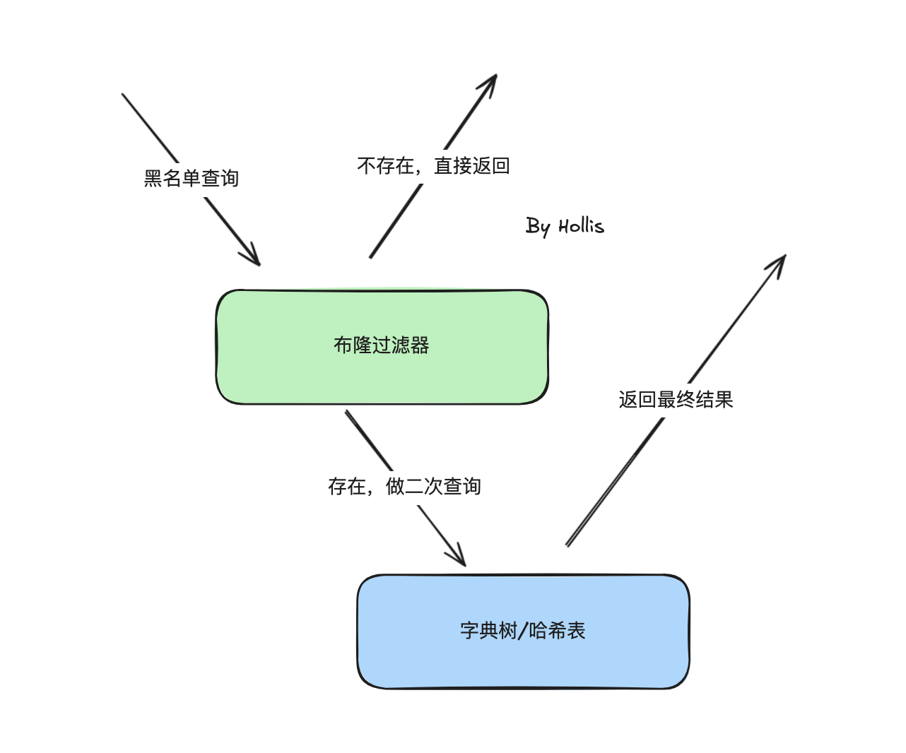
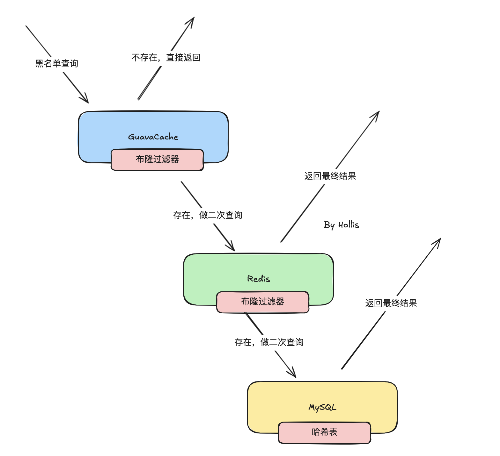

# ✅做一个过滤黑名单网址的系统，你觉得要怎么实现，会用到哪些数据结构？

# 典型回答

要实现一个过滤黑名单网址的系统，我们需要考虑的因素有很多，比如黑名单的存储、匹配和查询的性能、系统扩展性等。

可以使用的数据结构有以下几个。逐一来分析一下。

**哈希表（Hash Table）**：可以用哈希表存储每个黑名单网址的域名或完整URL，查询时只需将请求URL进行哈希并查表即可。优点是可以在 O(1)时间复杂度上进行高效的数据查询。但是缺点是不支持模糊匹配和前缀匹配，以及对内存耗费比较大。

在关于敏感词过滤的介绍中，我们**前缀树**也可以用来解决我们的黑地址的场景。

[✅如何实现敏感词过滤？](https://www.yuque.com/hollis666/oolnrs/dgsbltylfglksuv0)

**前缀树，也被称为Trie树**，是一种用于快速检索字符串数据集中的键的树形数据结构。可以使用Trie树存储域名和URL前缀。如果要判断某个域名是否属于黑名单，可以进行前缀匹配，从而发现某些子域名是否也属于黑名单。他能解决哈希表不支持前缀查询的问题。但是他同样有一个缺点，那就是比较耗内存的问题仍然没有解决。

**布隆过滤器（Bloom Filter）****，**我们也介绍过，这个是一个非常适合使用在黑名单场景的数据结构。因为他底层是基于 bitmap 实现的，每一个地址存储下来只需要一个 bit，所以内存占用比较小。但是他的缺点也比较明显，那就是存在误判的问题，以及无法做删除。具体原因详见：

> 为什么黑名单适合用布隆过滤器？
>
> 因为黑名单应该是比较少的，大多数的地址应该是不在黑名单中的。而布隆过滤器如果返回不存在，那么说明数据一定是不存在的，不存在误判的情况。所以在误判率可控（一般都是我们设置的）的情况下，对于大部分请求来说，都可以直接通过布隆过滤器判断后返回。而对于一些少量的请求，如果被判断为存在，那么就再去其他存储中查询下做二次判断即可。
>

[✅什么是布隆过滤器，实现原理是什么？](https://www.yuque.com/hollis666/oolnrs/gp9ymie1n39uavah)

那么，就没有一个好一点的方案了吗。有，那就是组合防范，即基于布隆过滤器+哈希表/前缀树。布隆过滤器可以用作一个第一层的筛选器，如果判断元素**不在**黑名单中，则直接放行。如果认为元素**可能在**黑名单中，则进一步进行精确查找（如通过哈希表或Trie）。

以上是从数据结构角度说的，也就是说直接把黑名单放到内存中，可以用这样的方案来做，但是其实基本没人这么做，因为都放到内存，内存扛不住啊。

所以，如果真的是一个方案设计？最终还得靠存储，那么实际上的方案应该是本地缓存+Redis+数据库。在本地缓存和Redis 中，可以用布隆过滤器这种数据结构，然后数据库的索引我们可以选择用 hash 结构

那么其实就变成了一个以下的方案（这里的本地缓存可选）：

> 更新: 2025-07-21 22:11:20  
> 原文: <https://www.yuque.com/hollis666/oolnrs/yrlc3c4ywe3ueugr>