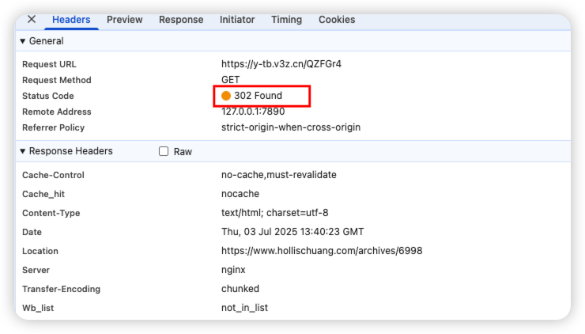

# ✅让你实现一个短链服务，你会考虑哪些问题?

# 典型回答

短链服务大家都知道是啥，就是把一个长链接转成短链接，然后用户可以通过短链接访问到长链接对应的网站，那么，想要实现一个短链接服务，需要重点考虑以下几个问题：

****

**1、短链生成算法**

**2、长链和短链的存储**

**3、如何实现短链跳转到长链**

**4、如何确保短链跳转的高性能**

**5、针对热门短链如何提升性能**

**6、如何防止短链被滥用**

**7、是否需要统计访问数据**

**8、同一个长链生成的短链是否要一致**

**9、短链是否需要有过期机制**

****

问题定义好之后，就可以逐一的想办法解决了。

### 短链生成算法

要生成一个不重复的短链接，在行业内有一种比较常见的做法，那就是**基于****MurmurHash+62进制转换的方式来实现。这个方案同时兼顾快+冲突少+短等优点。**

****

**具体的什么是Murmurhash，原理是啥，以及为啥要用62进制，可以看下面这篇文章，介绍的很全面了。**

[✅如果让你实现短链服务，如何生成不重复的短链地址？](https://www.yuque.com/hollis666/oolnrs/hqbaavfnq7pofa9h)

### **长链和短链的存储**

短链和长链，是一对。当我们把`https://www.hollischuang.com/archives/6998`通过短链服务转成`https://y-tb.v3z.cn/QZFGr4`这样的链接之后，我们会把短链接分享出去。

那么用户通过短链接来访问的时候，就需要知道这个短链对应的长链接是什么，就需要有个地方来存储他们之间的关系。

其实，这个比较容易想到是比较适合用Redis这种K-V存储来保存的，我们只需要把短链接作为key，长链接作为value，在用户用短链接访问的时候，通过key去查询出长链接就行了。

但是这里需要注意的是，Redis的存储不能保证100%可靠，所以还是需要定时的同步到MySQL中，确保数据不丢。

### 如何实现跳转

当我们从Redis中找到了短链接对应的长链接之后，是需要让浏览器做跳转的，那么，想要跳转就涉及到2种了，分别是301和302。

+ **HTTP 301/302**：
    - **301 永久重定向**：资源已经永久移动到新的 URL，浏览器和搜索引擎会缓存这个重定向结果。
    - **302 临时重定向**：资源临时移动到新的 URL，客户端不应该缓存，后续请求仍然访问旧 URL。

所以，**其实301和302最大的区别主要是302因为不会被浏览器缓存，所以会每次访问短链都会经过服务端重新查一下新的长链接。而301则不需要，会被浏览器缓存，下次再访问就直接跳转了。**

适合用哪个？我认为302比较合适一点，以下几个原因：

1、因为302这种我们可以做数据统计，可以统计出一个短链的实时记录访问数据（PV/UV、来源、设备等）。而301则无法被统计。

2、而且有些短链如果需要支持修改的话，302也是更加合适的。

3、302可以随时上手段，比如拦截某个跳转，而301则会脱离控制。

比如我用的短链服务，底层就是使用的302跳转。

当然，如果是有特殊的情况，比如地址都是安全可靠的（比如内部地址），不需要数据统计，并且也不支持修改，可以考虑用301，因为这样性能更好。

### 短链的性能

前面讲过了， 如果想要提升性能，我们首先把短链和长链存储在Redis中，并且针对一些热门短链，也可以放到本地缓存一份。

而且一些对性能机制要求的场景，可以考虑用301跳转。

并且针对一些高频的短链，也可以做单独存储，或者在Redis集群中做分片存储，减少热点key情况的发生。（包括本地缓存也能解决热key问题）

[✅什么是热Key问题，如何解决热key问题](https://www.yuque.com/hollis666/oolnrs/lysd3t)

### 短链过期机制

短链有些可以设置有效期，所以可以做一些过期机制。

比较容易想到的就是借助Redis的key的过期机制，设置一个超时时间。行肯定是行的，但是需要注意的是，Redis的过期并不保证一定会删除的（可能会惰性删除），但是其实也没关系，只要设置了过期时间就行，会虽迟但到的。

数据库中的链接存储数据，起个定时任务，定时扫描一下就可以了，或者干脆不用扫描，直接在表里加个有效期，每次查询的时候都拿当前时间和有效期对比下，如果一致，再返回。

### 短链的唯一性

如果针对同一个长链接，需要做防重复的话，就需要考虑几个方案：

1、数据库给长链接设置唯一索引

2、同一个长链接生成短链的时候加分布式锁

以上方案要同时做。

### 短链防滥用

防滥用很重要，防止整个服务都被封了。需要做以下机制：

+ 短链内容扫描：对目标链接进行黑名单校验、恶意网站检测（第三方API或自建规则）。
+ 审核机制：新短链先通过人工/自动审核后生效。
+ 采用足够长度和随机性的短链码，避免简单枚举。
+ 短链访问频率限制（IP+短链维度），防止暴力扫描。
+ 用户登录系统，短链绑定用户ID。有问题知道找谁。
+ 接口鉴权（API Key、OAuth2等）保护短链生成接口。

> 更新: 2025-07-25 21:38:08  
> 原文: <https://www.yuque.com/hollis666/oolnrs/sfsui1laabpxxrqr>