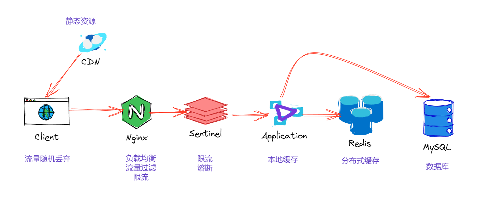

# ✅让你设计一个秒杀系统，你会考虑哪些问题？

# 典型回答

这个问题是一个比较考验知识储备、灵活运用能力、以及问题解决能力的问题。

想要回答好这个问题，首先需要学会做问题的拆解，所谓的定义问题。作为一个5年工作经验以上的人，尤其是偏架构方向的技术人员，**要先学会如何定义问题，然后才是解决问题**。如果定义问题都做不好，所谓的解决的也都是伪问题。没意义了

秒杀系统，我们需要先**拆解**一下他会遇到哪些问题，面试官在问这个问题的时候，其实在问的到底是什么问题？

一个秒杀系统，有以下几个特点，需要解决这么几个问题：

**1、高并发瞬时流量**

**2、热点数据**

**3、数据量大**

**4、库存的正确扣减**

**5、黄牛抢购**

**6、重复下单**

**7、对普通交易的影响**

那么，在定义出这个7个问题以后，就可以逐一的想办法解决了。

### 高并发瞬时流量

秒杀是一个典型的具有高并发瞬时流量的场景，在这种情况下，如何提升系统的稳定性、可用性就至关重要了。

一般来说，我们在整体架构设计上面，会做**逐层的流量过滤 ，一次用户的秒杀请求会经过客户端、CDN、Nginx、Web应用、缓存、数据库等等。**

****

****

首先是秒杀功能的开启，以及前端资源的访问，这部分内容一般都是提前放到CDN中，让这些静态资源离用户更近就能让用户访问的更快。

****

接下来，能做的就是**尽量在离用户更近的地方做流量的过滤**，比如很多秒杀系统，会在前端，也就是客户端层面做一些请求的随机丢弃，这些被丢弃的请求就直接返回失败，或者系统繁忙，让用户重试。过滤掉一部分流量向服务端发送。

在服务端接受请求之前，还会先经过Nginx做统一接入，Nginx不仅可以用来做负载均衡和流量的分发，其实他也是可以做流量的过滤的，这里面可以配置一些黑白名单、可以通过IP进行限流、也可以做一些业务校验都是可以的。

再之后就是到服务器上面了，服务器层面也是配置很多限流策略的，基于sentinel，或者自己实现一些限流算法，都是可以做动态限流的、

还有就是，服务器中有一些查询操作，和一部分写操作，其实是可以用缓存来抗一下的。在缓存上，**本地缓存要比分布式缓存的性能更高**，近端缓存要好于远端缓存。

因为秒杀业务上本来就是支持失败的，所以，我么就可以通过层层过滤，让更多的流量在前面被过滤掉。

[✅如何设计一个能够支持高并发的系统？](https://www.yuque.com/hollis666/oolnrs/gfgqpua8gu3oag44)

[✅服务端接口性能优化有哪些方案？](https://www.yuque.com/hollis666/oolnrs/ifuuagaqo3yd8vqb)

### 热点数据

秒杀系统另外一个比较典型的特点就是会存在热点数据，因为大家都会抢购同一件商品，那么这个商品就会变成热点数据。

对于热点数据，不仅有高频的查询请求，还会有非常高频的写请求，比如库存的扣减等等。

关于库存扣将我们后面单独说，这里先说查询请求和其他的写请求。

对于**这种热点数据，解决方案主要就是拆分+缓存**。

首先说拆分，就是把一个热点的数据，拆分开，拆成没那么热的多个数据，在通过负载均衡让不同的请求分散到不同的数据上。

还有就是用缓存，一般来说，秒杀是可以提前预知哪些数据会变成热点的，所以可以提前做一些缓存的预热，对于热点数据，不仅需要在Redis中做预热，还需要在本地缓存也做预热，避免Redis的热key问题。

[✅什么是预热？它有何作用？](https://www.yuque.com/hollis666/oolnrs/gr4z7dqg4evp5ubz)

[✅什么是热Key问题，如何解决热key问题](https://www.yuque.com/hollis666/oolnrs/lysd3t)

### 数据量大

秒杀系统会有高频的下单，那么就会导致最终数据量也会很多，那么最终产生的订单量可能就会很大。

数据量一大，就会带来查询效率低的问题。

这时候就可以考虑**要么就加缓存、要么就用ES、要么就做分库分表。还有就是做数据归档**，把历史数据归档掉，无非就是这么几个方案了。

[✅什么是分库？分表？分库分表？](https://www.yuque.com/hollis666/oolnrs/wpus0g)

### 库存的正确扣减

秒杀因为是一个高频的并发库存扣减的场景，所以，如何提升库存扣减的性能，并且保证他的准确性，这是一个在秒杀业务中极其重要的课题，稍有不慎就会带来超卖、少卖等问题。

这几个我们单独讲：

[✅库存扣减如何避免超卖和少卖？](https://www.yuque.com/hollis666/oolnrs/qpnna44eczny06z7)

### 黄牛抢购

秒杀商品一般都有差价可以赚，所以会有很多黄牛来一起抢购，那么如何识别这些黄牛，并阻挡他们的下单，也是比较关键的。

首先防刷最重要的就是检测哪些用户可能是黄牛，这其实就涉及到风控的领域了，一般都是需要借助算法模型，根据用户的IP、设备信息、网络信息、行为数据等进行分析。

那么算法推算出哪些可能是黄牛用户以后，就需要我们针对他们的流量进行防控。

这部分用户的ID直接可以加入黑名单中，然后黑名单可以在Nginx中，以及业务系统中都可以做过滤，如果发现用户在黑名单中，就直接拒绝请求。

除了用户ID以外，还需要对他的IP地址、设备等进行限流，比如限制某个IP一段时间内只能下单几次，基于令牌桶、漏桶等限流算法都能实现。

我们也可以直接借助nginx、sentinel、guava等进行限流的实现。

[✅什么是限流？常见的限流算法有哪些？](https://www.yuque.com/hollis666/oolnrs/aw1zho)

还有一种防刷，是防止别人直接通过脚本的方式直接调我们的接口，这种的话，我们可以借助token的方式实现防刷。

当用户访问页面时，发放一个token，请求过来时，需要把token带过来，这时候我们做校验，token合法则接受请求，并且让token失效。token不合法或者已失效则直接拒绝请求即可。

### 重复下单

在秒杀业务中，很多用户会频繁尝试下单支付，那么就可能造成重复下单。那么就会额外占用我们的库存，最终导致少卖。

那么，我们就需要通过一些手段来避免重复下单。

首先，基于我们前面提到的token，是可以做重复下单的检测的，也就是说如果用户在一个页面上，没刷新页面的话，token是一样的，那么我们基于token做重复下单检测就行了。这样可以避免重复下单。

另外，秒杀业务中，其实通常都是限购的，所以我们可以结合业务场景，判断用户是否已有在途订单，通过限购方式避免重复下单。

那么，在以上过程中，都可能出现token检测、以及订单重复性判断时因为并发导致重复的，那么就需要引入锁机制来保证下单操作的幂等。

[✅如何解决接口幂等的问题？](https://www.yuque.com/hollis666/oolnrs/gz2qwl)

### 对普通交易的影响

秒杀一般是电商网站中的一个功能，大多数情况下是和其他的业务在一起部署的，不仅是服务器，还包括缓存、数据库这些。

那么我们就需要想办法来避免秒杀业务对于普通交易的影响过大的问题。

这时候就需要考虑到隔离了。隔离有两种，逻辑隔离和物理隔离。想要彻底的话，那肯定是物理隔离。

所谓物理隔离，就是前后端服务、包括数据存储都彻底分开。

或者应用上面做物理隔离，数据上做逻辑隔离。数据的逻辑隔离就是在订单、商品上面打标，标记出来是秒杀订单，方便后续查询及数据分析等。

# 扩展知识

## 业务手段

有的时候，我们不能只想着用技术手段解决所有问题，其实，如果在业务上能做点事情的话，如果这些做法并不影响用户体验，那么就可能让技术实现上大大简化方案，整个系统的成本和稳定性也会有大大的提高。

比如我们前面说的限购。

再比如说，在有些秒杀业务中，需要先预约，预约通过后才能参与秒杀，这就大大的降低了秒杀时的请求量了。

再比如说很多电商最近再搞一些预售的功能，其实也是有这方面的考虑的。

还有就是秒杀时通过一些验证码、问题等，也可以降低瞬时的高并发流量，以及降低被脚本刷单的风险。

> 更新: 2025-07-21 22:10:38  
> 原文: <https://www.yuque.com/hollis666/oolnrs/lghq5y>