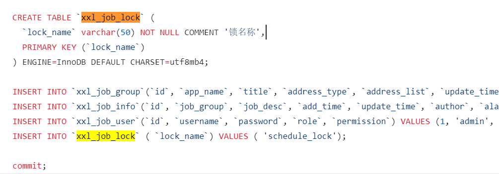
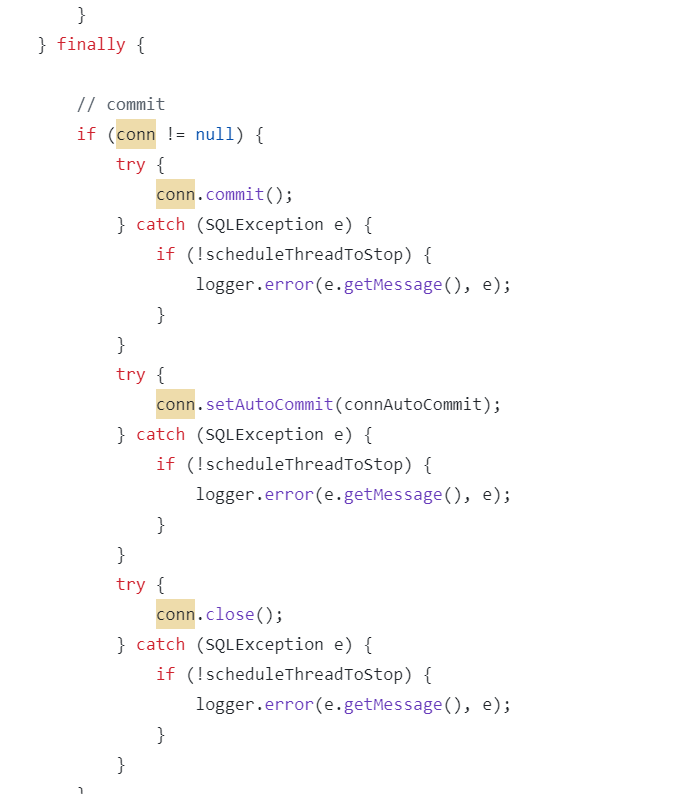

# ✅xxl-job如何保证一任务只会触发一次？

# 典型回答

XXL-JOB 作为一个定时任务调度工具，他需要确保同一时间内同一任务只会在一个执行器上执行。这个特性对于避免任务的重复执行非常关键，特别是在分布式环境中，多个执行器实例可能同时运行相同的任务。

这个特性被XXL-JOB描述为“调度一致性”，并且官方文档也给出了这个问题的答案：

“调度中心”通过DB锁保证集群分布式调度的一致性, 一次任务调度只会触发一次执行；

调度中心在XXL-JOB中负责管理所有任务的调度，它知道哪些任务需要执行，以及任务的调度配置（如CRON表达式）。当到达指定的执行时间点，调度中心会选择一个执行器实例来执行任务。

**调度相关的JobScheduleHelper是XXL-JOB中的一个核心组件，负责协调任务的调度逻辑**，确保任务触发的正确性和唯一性。

通过查看[JobScheduleHelper](https://github.com/xuxueli/xxl-job/blob/master/xxl-job-admin/src/main/java/com/xxl/job/admin/core/thread/JobScheduleHelper.java)的源码，在他的scheduleThread的方法中，我们可以看到以下代码

这里面的`select * from xxl_job_lock where lock_name = 'schedule_lock' for update`是关键，这明显是一个基于数据的悲观锁实现的一个加锁过程。

>  xxl_job_lock是XXL-JOB的一张表，是一张任务调度锁表；在使用XXL-JOB的时候需要提前创建好这张表。并且需要提前插入一条记录：INSERT INTO `xxl_job_lock` ( `lock_name`) VALUES ( 'schedule_lock');
>
> 
>
> 来自 tables_xxl_job.sql
>

通过`select for update`的方式添加一个悲观锁，可以确保在同一时刻，只能有一个事务获取到锁。这样获取到锁的线程就可以执行任务的调度了。

[✅乐观锁与悲观锁如何实现？](https://www.yuque.com/hollis666/oolnrs/ionc18)

并且这个锁会随着事务的存在一直存在，这个事务最最终是在方法的finally中实现的：

> 更新: 2025-07-21 22:11:15  
> 原文: <https://www.yuque.com/hollis666/oolnrs/kgrtbyygyu5wnsgx>