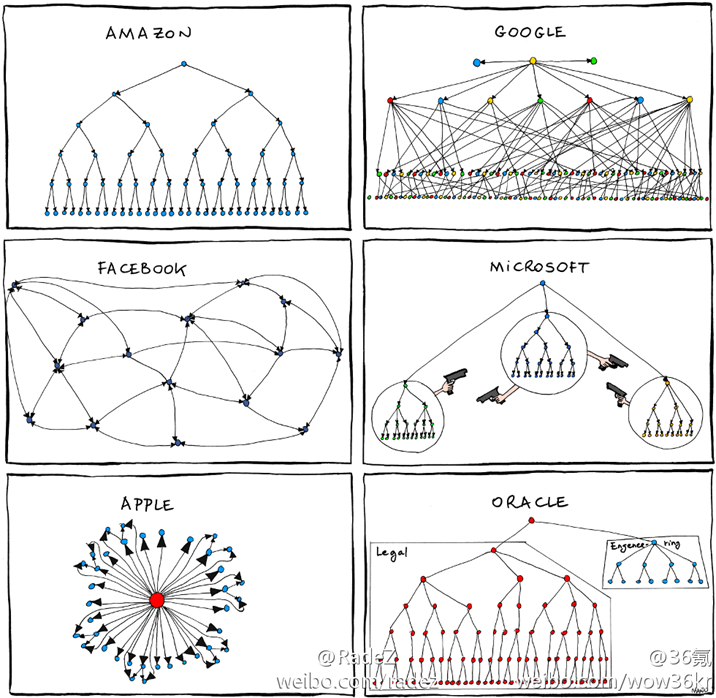

# ✅什么是康威定律？

# 典型回答

康威定律有各种各样的解读，我觉得比较重要的就是这句话：

Organizations which design systems are constrained to produce designs which are copies of the communication structures of these organizations. - Melvin Conway(1967)

中文直译大概的意思就是：设计系统的组织，其产生的设计等同于组织之内、组织之间的沟通结构。

看看下面的图片（图片是好几年前的了，但是不重要，足够说明白事情了），再想想Apple的产品、微软的产品设计，就能形象生动的理解这句话。

简单点说其实就是企业的组织结构决定了业务架构、系统架构。而系统架构的不合理，往往是因为组织架构不合理导致的。

**所以很多人说，康威定律如何在半个世纪前就奠定了微服务架构的理论基础**

（1）人与人的沟通是非常复杂的，一个人的沟通精力是有限的，所以当问题太复杂需要很多人解决的时候，我们需要做拆分组织来达成对沟通效率的管理

（2）组织内人与人的沟通方式决定了他们参与的系统设计，管理者可以通过不同的拆分方式带来不同的团队间沟通方式，从而影响系统设计

（3）如果子系统是内聚的，和外部的沟通边界是明确的，能降低沟通成本，对应的设计也会更加高效。

（4）复杂的系统需要通过容错弹性的方式持续优化，不要指望一个大而全的设计或架构，好的架构和设计都是慢慢迭代出来的

**康威定律的实践建议**

（1） 我们要想尽办法来提升沟通效率，比如使用各种工具。能 2 个人讲清楚的事情，就不要拉更多人，每个人每个系统都有明确的分工，出了问题知道马上找谁，避免踢皮球的问题。

（2） 通过 MVP（Minimum Viable Product即最小化可行产品） 的方式来设计系统，通过不断的迭代来验证优化，系统应该是弹性设计的。

（3） 你想要什么样的系统设计，就架构什么样的团队，能扁平化就扁平化。最好按业务来划分团队，这样能让团队自然的自治内聚，明确的业务边界会减少和外部的沟通成本，每个小团队都对自己的模块的整个生命周期负责，没有边界不清，没有无效的扯皮，inter-operate, not integrate。

（4） 做小而美的团队，人多会带来沟通的成本，让效率下降。亚马逊的 Bezos 有个逗趣的比喻，如果 2 个披萨不够一个团队吃的，那么这个团队就太大了。事实上一般一个互联网公司小产品的团队差不多就是 7，8 人左右（包含前后端测试交互用研等，可能身兼数职）。

> 更新: 2025-07-21 22:10:45  
> 原文: <https://www.yuque.com/hollis666/oolnrs/rcgubon7keglqt75>