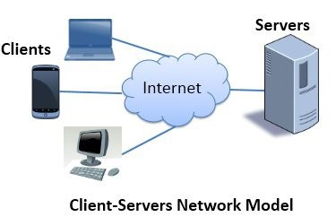
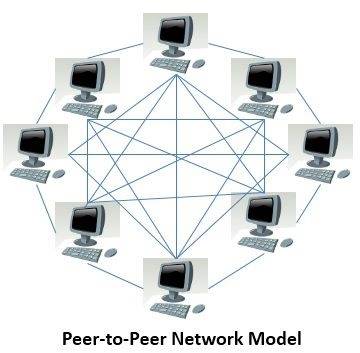

# ✅分布式和微服务的区别是什么？

# 典型回答

分布式是把一个集中式系统拆分成多个系统，每一个系统单独对外提供部分功能，整个分布式系统整体对外提供一整套服务。对于访问分布式系统的用户来说，感知上就像访问一台计算机一样。

而**分布式架构的具体实现有很多种，这其中包括了C/S架构、P2P架构、SOA架构、微服务架构、Serverless架构等**

**所以，微服务架构是分布式架构的一种。**

# 扩展知识

## C/S架构

C/S架构，就是Client/Server (C/S)架构，在这种架构中，客户端应用程序通过网络连接到一个或多个服务器，并向服务器发送请求以获取服务或数据。服务器负责处理客户端的请求并返回相应的结果。这种架构常见于Web应用程序、数据库系统等。

在传统的C/S模式下，我们想要下载一个20G的电影，我们需要找到一个提供该电影资源的网站，然后连接网站的服务器连续下载。也就是要从文件原始位置开始下载这20G的完整数据。

这种下载方式有什么缺点？

1、首先这种方式比较依赖服务器的可用性，也就是说，如果服务器挂了，那么就电影的下载不得不终止。

2、如果想要下载电影的人数增多，网站的带宽就会成为瓶颈，就会导致大家下载速度下降，甚至有人无法下载。

3、由于所有资源都通过服务器端输出，别人想要攻击的话也相对方便，只要攻击服务器就可以了。  

## P2P架构

P2P，是Peer-To-Peer 的简称，翻译成"对等网络"或者"点对点网络"。P2P是一种分布式网络，网络的参与者共享他们所拥有的一部分硬件资源（处理能力、存储能力、网络连接能力、打印机等），这些共享资源需要由网络提供服务和内容，能被其它对等节点(Peer)直接访问而无需经过中间实体。在此网络中的参与者既是资源（服务和内容）提供者（Server），又是资源（服务和内容）获取者（Client）。

正是因为C/S模式存在着这些问题，于是P2P就应运而生。

P2P打破了传统的C/S模式，在网络中的每个结点的地位都是对等的。每个结点既充当服务器，为其他结点提供服务，同时也享用其他结点提供的服务。

在P2P模式下，如果有多个人想要下载同一个电影的话，大家就可以不必分别从服务器下载完整的20G的电影。

由于采用了P2P模式，那么每一个用户就可以既充当客户端又可以充当服务器。

如果4个人同时下载20G电影，那么4个人分别各自下载了不一样的部分，然后在下载的同时进行相互传送。

这样大家一边从服务器下载得到数据，一边从别的下载的人那里得到数据，就比单一从服务器下载来得快。

P2P架构具有非中心化、可扩展、高性能、高性价比等优点。

P2P架构在很多方面都有应用，比如我们常用的很多下载软件，如BT、迅雷等。

## Serverless架构

Serverless，即无服务架构，是一种将应用程序逻辑交给云服务提供商管理的架构形式。

应用程序以**函数**的形式运行，通过事件驱动的方式触发。无服务架构将基础设施管理的责任交给云平台，开发人员可以专注于业务逻辑。无服务架构适用于快速开发、弹性扩展和按需计费的场景。

## 微服务&SOA

[✅什么是微服务架构？优势？特点？](https://www.yuque.com/hollis666/oolnrs/zao7sn0kve58xasr)

[✅SOA和微服务之间的主要区别是什么？](https://www.yuque.com/hollis666/oolnrs/fkg3572ih9pye728)

> 更新: 2025-07-21 22:10:43  
> 原文: <https://www.yuque.com/hollis666/oolnrs/av4fdpxuxauxym6k>