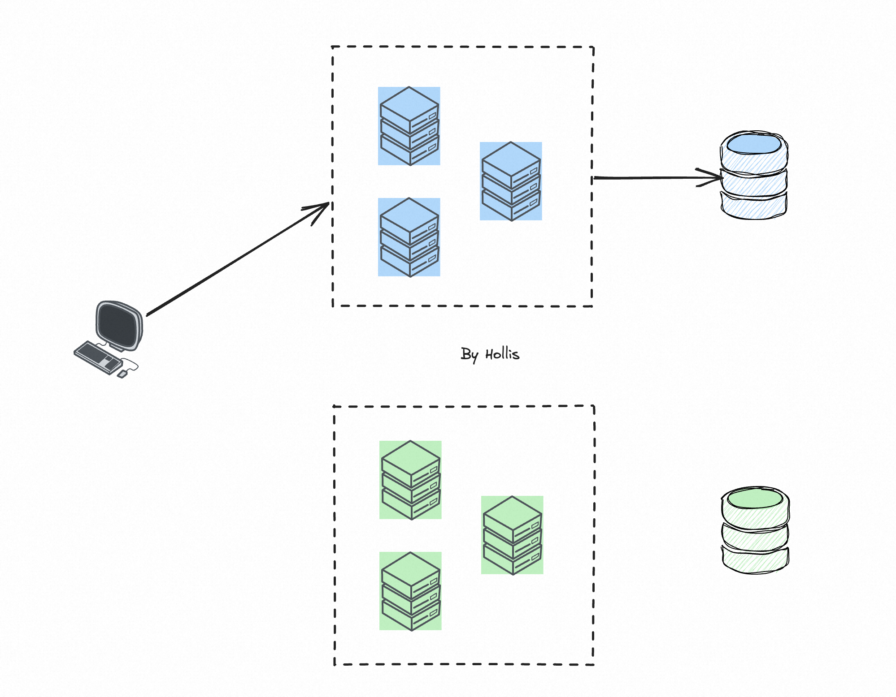
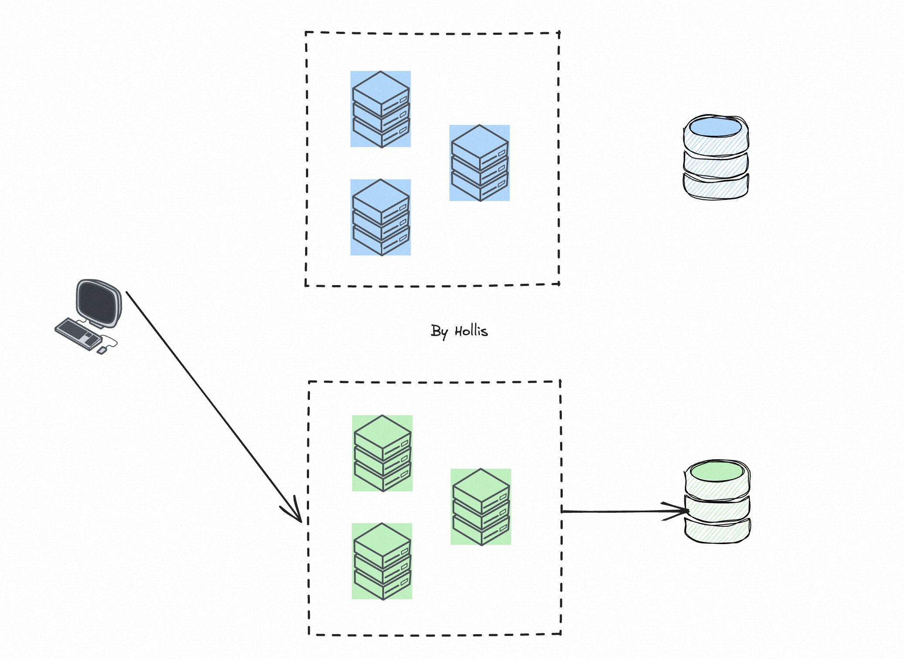
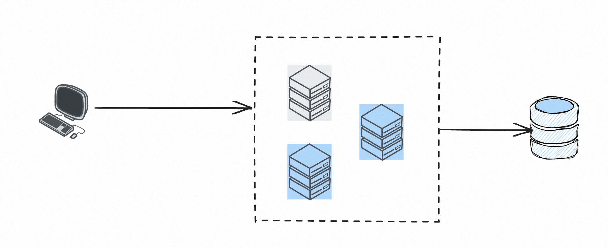

# ✅灰度发布、蓝绿部署、金丝雀部署都是什么？

# 典型回答

蓝绿部署、金丝雀发布（灰度发布）这些都是软件部署和发布中常用的一些策略和技术，用于实现在生产环境中逐步更新和验证新版本的方式。它们的主要目标是降低部署风险、确保服务稳定性，并实现快速、高效的软件发布。

**蓝绿部署**是一种在部署新版本时，准备两套完全相同的生产环境，称为蓝环境（Blue Environment）和绿环境（Green Environment）。初始状态下，用户的请求都会被路由到蓝环境，而绿环境处于闲置状态。

当新版本部署完成并测试通过后，将流量切换到绿环境，此时绿环境变为主要的生产环境，而蓝环境则成为备份环境。

当然，在这个切流过程也不是一下100%都要切过来的，也可以先切流一部分，观察一段时间，然后再逐步扩大切流比例，最终完成整体切流。

蓝绿部署的优点是可以实现快速回滚，只需要将流量切回到蓝环境即可。但是他的缺点也比较明显，蓝绿部署有一套闲置环境，这就意味着有一半的机器是不会对外提供服务的，那么就会导致很大的资源浪费。

**金丝雀发布**，其实就是灰度发布，之所以叫金丝雀发布，是因为金丝雀对矿场中的毒气比较敏感，所以在矿场开工前工人们会放一只金丝雀进去，以验证矿场是否存在毒气。

与蓝绿部署不同的是，它不需要有一组闲置的服务器，他又叫灰度发布。

在这种方式中，会在整个服务器集群中，挑选一部分机器进行灰度发布，发布会直接对外提供服务，通过给这些已发布的机器引流，来验证服务是否正常。

通过灰度发布，可以在生产环境中测试新版本的稳定性和性能，如果发现问题，可以及时回滚或修复。逐渐增加新版本的流量也可以降低风险，确保系统的稳定性。

一般来说，灰度发布要比蓝绿发布好一些，毕竟他没那么浪费资源，唯一的问题就是回滚不太容易做，需要把已发布应用退回到上一个版本中。

# 扩展知识

## 如何快速回滚

有个好的办法，那就是记录基线。应用在发布前，把应用相关的内容，如环境、容器、war包等全部都记录下来，在需要回滚时，直接基于这个基线进行快速部署即可。

> 更新: 2025-07-21 22:10:49  
> 原文: <https://www.yuque.com/hollis666/oolnrs/onc7gmb0928xwhgp>