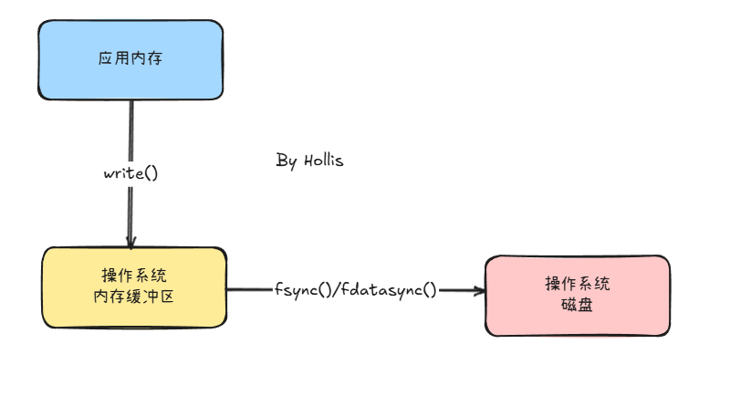

# ✅write和fsync的区别是什么？

# 典型回答

`write` 和 `fsync` 是操作系统中常用的文件 I/O 操作，它们都与数据写入磁盘有关。

`write` 是把数据写入内存缓存区，`fsync` 是把内存缓冲区数据真正刷到磁盘。  

除了这两个。还有一个 `fdatasync` ,它将指定文件的数据部分从操作系统缓存中同步到磁盘，但可能不会刷新元数据（比如文件的修改时间、权限等）。  

因为`write` 是把数据写入内存缓存区，如果没有来得及写入磁盘，操作系统就崩溃或者断电了，那么这个数据就丢了。

> 现在也可以在RAID 控制器上配备电池模块的RAID 卡。这种电池通常被称为“电池备份单元(BBU)”或“RAID 卡电池”，主要作用是在服务器断电时，为RAID 控制器上的高速缓存（RAM）提供电力，以确保缓存中的数据安全地写入硬盘，防止数据丢失。
>

需要注意的是，如果一个数据想要写入磁盘，可以只进行write，但是不能只进行fsync或者fdatasync，因为要先写入缓冲区才能通过fsync/fdatasync同步到磁盘。

但是如果write之后没有执行fsync/fdatasync的话，操作系统也会在后台把缓存区中的数据异步刷到磁盘（例如通过 pdflush）。  但是前提还是不断电。

> 更新: 2025-07-21 22:11:12  
> 原文: <https://www.yuque.com/hollis666/oolnrs/tepksitlo9sri5rd>