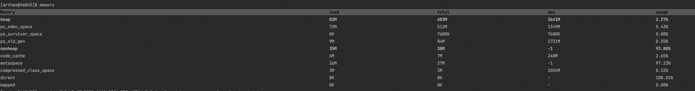

# ✅如何针对大Excel做文件读取？

# 典型回答


在POI中，提供了SXSSFWorkbook，通过将部分数据写入磁盘上的临时文件来减少内存占用。但是SXSSFWorkbook只能用于文件写入，但是文件读取还是不行的，就像我们前面分析过的，Excel的文件读取还是会存在内存溢出的问题的。


[✅什么是POI，为什么它会导致内存溢出？](https://www.yuque.com/hollis666/oolnrs/gcxwx1gnimfyamvw)


[✅POI的如何做大文件的写入](https://www.yuque.com/hollis666/oolnrs/kalmkdx5fukxt13q)


那如果要解决这个问题，可以考虑使用EasyExcel


> EasyExcel是一个基于Java的、快速、简洁、解决大文件内存溢出的Excel处理工具。他能让你在不用考虑性能、内存的等因素的情况下，快速完成Excel的读、写等功能。
>


关于使用XSSFWorkbook和EasyExcel的文件读取，我这里也做了个内存占用的对比：


### XSSFWorkbook文件读取


读取一个27.3 MB的文件（文件的生成代码在[✅POI的如何做大文件的写入](https://www.yuque.com/hollis666/oolnrs/kalmkdx5fukxt13q)中）


```java
package excel.read;

import org.apache.poi.ss.usermodel.*;
import org.apache.poi.xssf.usermodel.XSSFWorkbook;

import java.io.File;
import java.io.FileInputStream;
import java.io.IOException;

public class XSSFExcelReadTest {

    public static void main(String[] args) {
        // 指定要读取的文件路径
        String filename = "example.xlsx";

        try (FileInputStream fileInputStream = new FileInputStream(new File(filename))) {
            // 创建工作簿对象
            Workbook workbook = new XSSFWorkbook(fileInputStream);

            // 获取第一个工作表
            Sheet sheet = workbook.getSheetAt(0);

            // 遍历所有行
            for (Row row : sheet) {
                // 遍历所有单元格
                for (Cell cell : row) {
                    // 根据不同数据类型处理数据
                    switch (cell.getCellType()) {
                        case STRING:
                            System.out.print(cell.getStringCellValue() + "\t");
                            break;
                        case NUMERIC:
                            if (DateUtil.isCellDateFormatted(cell)) {
                                System.out.print(cell.getDateCellValue() + "\t");
                            } else {
                                System.out.print(cell.getNumericCellValue() + "\t");
                            }
                            break;
                        case BOOLEAN:
                            System.out.print(cell.getBooleanCellValue() + "\t");
                            break;
                        case FORMULA:
                            System.out.print(cell.getCellFormula() + "\t");
                            break;
                        default:
                            System.out.print(" ");
                    }
                }
                System.out.println();
            }
        } catch (IOException e) {
            e.printStackTrace();
        } 
    }

}

```


同样使用Arthas查看内存占用情况：


占用内存在1000+M。


### EasyExcel文件读取
```java
package excel.read;

import com.alibaba.excel.EasyExcel;
import com.alibaba.excel.context.AnalysisContext;
import com.alibaba.excel.read.listener.ReadListener;

public class EasyExcelReadTest {

    public static void main(String[] args) {
        // 指定要读取的文件路径
        String filename = "example.xlsx";

        EasyExcel.read(filename, new PrintDataListener()).sheet().doRead();
    }

}

// 监听器，用于处理读取到的数据
class PrintDataListener implements ReadListener<Object> {
    @Override
    public void invoke(Object data, AnalysisContext context) {
        // 处理每一行的数据
        System.out.println(data);
    }

    @Override
    public void doAfterAllAnalysed(AnalysisContext context) {
        // 所有数据解析完成后的操作
    }

    @Override
    public void onException(Exception exception, AnalysisContext context) throws Exception {
        // 处理读取过程中的异常
    }
}
```


同样使用Arthas查看内存占用情况：

### 


内存占用只有不到100M。


# 扩展知识


## EasyExcel为啥内存占用小


[✅EasyExcel为啥内存占用小？](https://www.yuque.com/hollis666/oolnrs/lwaomovww7yr4v7z)


> 更新: 2025-07-21 22:11:24  
> 原文: <https://www.yuque.com/hollis666/oolnrs/fqevsshv4hxvtx69>