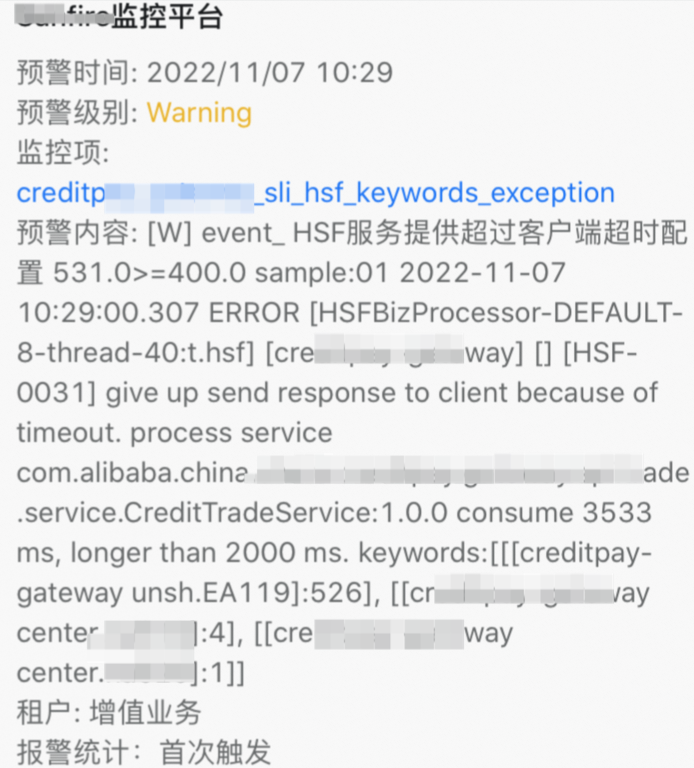
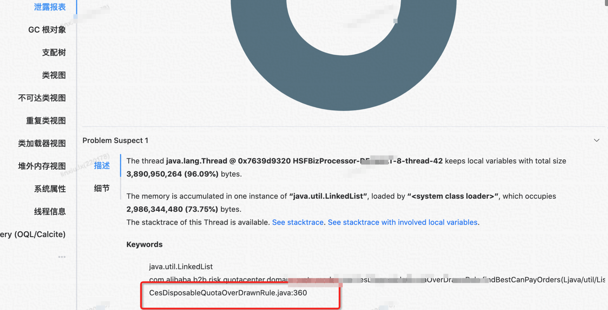
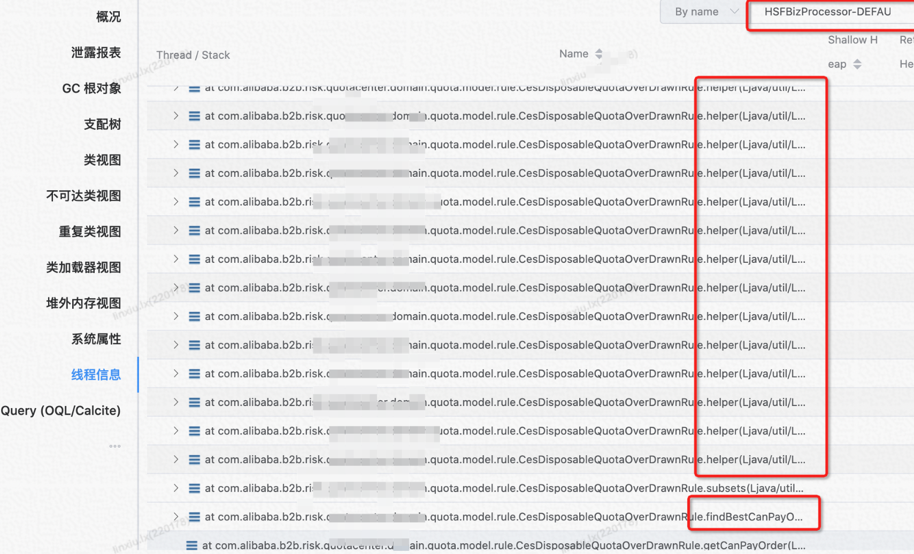

# ✅OOM问题排查过程

[✅OutOfMemory和StackOverflow的区别是什么](https://www.yuque.com/hollis666/oolnrs/rd8oyrewr8tcd9gc)

### 问题发现

某次双十一之前，线上突然出现大量报警。服务的调用方很多人也反馈请求超时的情况很多：

后来发现同时线上存在GC耗时特别长，GC也特别频繁的情况

### 问题定位

出现了这个现象之后，我们第一时间取拉了一下线上的堆DUMP。然后用我们的分析工具进行内存泄漏分析。

> 如果没有工具，可以用jmap和jhat分析。注意在GC前拉dump
>

可以看到，我们的一个LinkedList占用了73%的内存，很容易识别出来是发生了内存泄漏的问题。

该代码于问题发生前几日上线，目的是实现批量支付透支多笔算法，根据代码定位是这个算法存在问题，为了止血，第一时间通过配置中心将算法全部切回单笔算法，保证额度中心系统稳定后，继续进行分析。

根据崩溃线程可以看到程序在不断递归，递归的过程中内存不足了。

然后顺腾摸瓜，找到了具体的case,

然后定位到出现问题的代码，该算法输入一组订单input，以及该批订单最高可用额度maxQuota，返回最接近maxQuota的一组订单，实现用户可用额度应用尽用。

本质是一个nums与goal的问题，开发这个代码的同学认为这个问题在leetcode上是一道真题，[https://leetcode.cn/problems/closest-subsequence-sum/solution/by-mountain-ocean-1s0v/](https://leetcode.cn/problems/closest-subsequence-sum/solution/by-mountain-ocean-1s0v/)，我们解决这个问题的思路是分治加回溯，预计时间复杂度是o(n*(2^(2/n)))，

但是跟leetcode的需求不同的在于需求记录最接近目标值的一组订单，因为最后要返回的是订单序列，这也是为什么空间复杂度打爆的原因。

出问题的代码就不贴了，主要是开发者只考虑了时间复杂度，没考虑空间复杂度，导致OOM

### 
### 问题解决

定位到问题之后，就做了一把简单的优化，把"算法"干掉了，通过简单的方式其实就能实现。

**这个问题告诫我们，不要炫技！**

> 更新: 2025-07-21 22:11:01  
> 原文: <https://www.yuque.com/hollis666/oolnrs/vdnaxh>