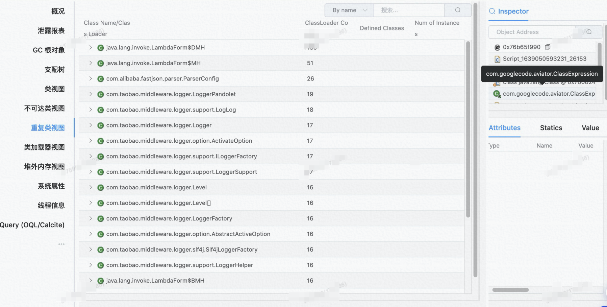
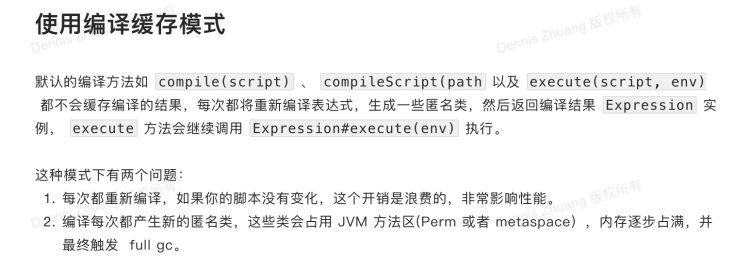
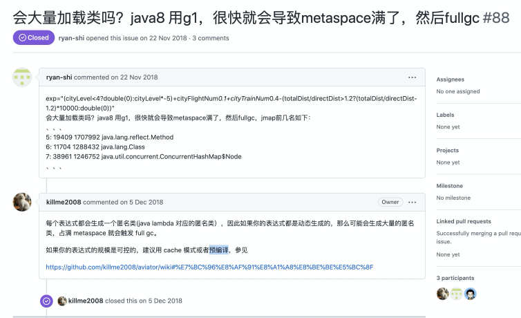
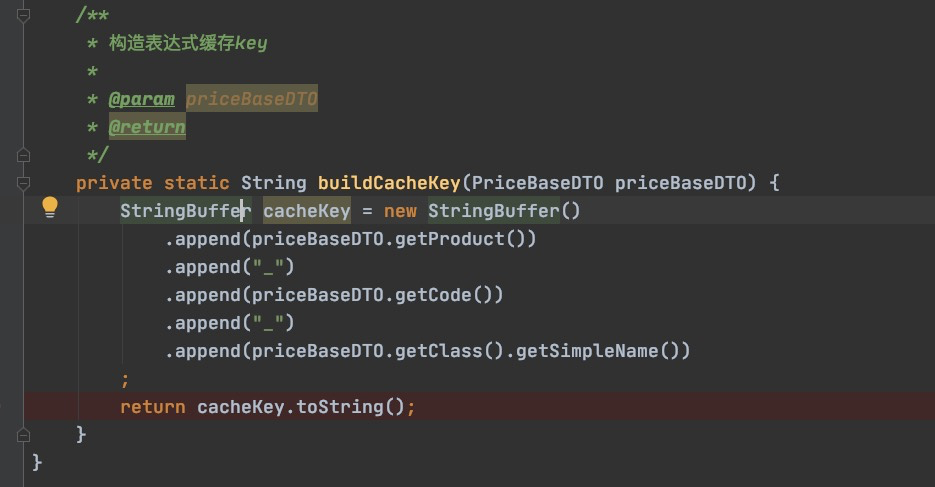

# ✅频繁FullGC问题排查

### 问题发现


通过监控工平台，查看到定价集群存在少量FullGC的情况，FullGC对于程序员来说其实是不能忍的，于是开始排查。


监控提示是MetaSpace发生fullGC，Metaspace中的类需要满足什么条件才能够被当成垃圾被卸载回收？

条件还是比较严苛的，需同时满足如下三个条件的类才会被卸载：

1. 该类所有的实例都已经被回收；
2. 加载该类的ClassLoader已经被回收；
3. 该类对应的java.lang.Class对象没有任何地方被引用。


### 问题定位


初步推测是有不停的动态创建类的过程，且有类未被回收；后来考虑到定价中存在轻量的表达式引擎AviatorEvaluator，会存在此过程；


于是dump出metaspace和heap





可以看到，存在非常多的Scrip_${timestamp}_${idx}类型的类


重复加载的类中，Top都是关于lambda表达式的


且指向了com.googlecode.aviator包 - 表达式引擎


找到了我的代码：


```plain
/**
 * 表达式处理工具类
 *
 * @author Hollis
 */
public class ExpressionUtil {

    public static AviatorEvaluatorInstance aviatorEvaluator = AviatorEvaluator.getInstance();

    static {
        aviatorEvaluator.setOption(Options.ALWAYS_PARSE_FLOATING_POINT_NUMBER_INTO_DECIMAL, true);
        aviatorEvaluator.setOption(Options.ALWAYS_PARSE_INTEGRAL_NUMBER_INTO_DECIMAL, true);
    }

    public static boolean verify(String expression, Map<String, Object> params) {
        return (Boolean)aviatorEvaluator.compile(expression).execute(params);
    }

    /**
     * 表达式计算
     * @param expression 表达式
     * @param params 需要替换的表达式参数
     * @return calculate result
     */
    public static BigDecimal calculate(String expression, Map<String, Object> params) {
        BigDecimal result = (BigDecimal)aviatorEvaluator.compile(expression).execute(params);
        return result.setScale(6, RoundingMode.HALF_UP);
    }
}

/**
   * Compile a text expression to Expression Object without caching
   *
   * @param expression
   * @return
   */
public Expression compile(final String expression) {
  return compile(expression, false);
}
```


+ 可以看到，我们在使用表达式引擎时，默认是无缓存的模式进行编译的。
+ AviatorEvaluatorInstance实例初始化时，会生成一个AviatorClassLoader类加载器


```plain
public final class AviatorEvaluatorInstance {

  private volatile AviatorClassLoader aviatorClassLoader = initAviatorClassLoader();

  private AviatorClassLoader initAviatorClassLoader() {
    return AccessController.doPrivileged(new PrivilegedAction<AviatorClassLoader>() {

      @Override
      public AviatorClassLoader run() {
        return new AviatorClassLoader(AviatorEvaluatorInstance.class.getClassLoader());
      }

    });
  }
  ...   
}
```


+ 编译过程主要分为如下几步
    - 文法分析
    - 初始化编码生成器
    - 语法解析器生成
    - 语法解析，实例化Class，最终的 Expression 对象


```plain
/**
  * 编译过程
**/
private Expression innerCompile(final String expression, final String sourceFile,
                                final boolean cached) {
    // 文法分析
    ExpressionLexer lexer = new ExpressionLexer(this, expression);
    // 初始化编码生成器
    CodeGenerator codeGenerator = newCodeGenerator(sourceFile, cached);
    // 语法解析器生成
    ExpressionParser parser = new ExpressionParser(this, lexer, codeGenerator);
    // 语法解析，实例化Class，最终的 Expression 对象
    Expression exp = parser.parse();
    if (getOptionValue(Options.TRACE_EVAL).bool) {
        ((BaseExpression) exp).setExpression(expression);
    }
    return exp;
}
```


+ 直接看编码生成器的初始化阶段
    - 首先，获取AviatorClassLoader类型的类加载器
    - 初始化OptimizeCodeGenerator的编码生成器
        * 类型为ASMCodeGenerator
        * classLoader=AviatorClassLoader
        * className="Script_" + System.currentTimeMillis() + "_" + CLASS_COUNTER.getAndIncrement();  <font style="color:#13C2C2;">- 与metaspace区的类信息吻合</font>

<font style="color:#13C2C2;"></font>

```plain
// 初始化编码生成器
public CodeGenerator newCodeGenerator(final String sourceFile, final boolean cached) {
    AviatorClassLoader classLoader = getAviatorClassLoader(cached);
    return newCodeGenerator(classLoader, sourceFile);

}

/**
   * Returns classloader
   *
   * @return
   */
public AviatorClassLoader getAviatorClassLoader(final boolean cached) {
    if (cached) {
        return this.aviatorClassLoader;
    } else {
        return new AviatorClassLoader(this.getClass().getClassLoader());
    }
}

/**
   * Returns CodeGenerator
   *
   * @return
   */
public CodeGenerator newCodeGenerator(final AviatorClassLoader classLoader,
                                      final String sourceFile) {
    switch (getOptimizeLevel()) {
        case AviatorEvaluator.COMPILE:
            ASMCodeGenerator asmCodeGenerator =
                new ASMCodeGenerator(this, sourceFile, classLoader, this.traceOutputStream);
            asmCodeGenerator.start();
            return asmCodeGenerator;
        case AviatorEvaluator.EVAL:
            // 默认走EVAL
            return new OptimizeCodeGenerator(this, sourceFile, classLoader, this.traceOutputStream);
        default:
            throw new IllegalArgumentException("Unknow option " + getOptimizeLevel());
    }
}

public OptimizeCodeGenerator(final AviatorEvaluatorInstance instance, final String sourceFile,
                             final ClassLoader classLoader, final OutputStream traceOutStream) {
    this.instance = instance;
    this.sourceFile = sourceFile;
    this.codeGen = new ASMCodeGenerator(instance, sourceFile, (AviatorClassLoader) classLoader,
                                        traceOutStream);
}

// 编码生成器，会创建一个匿名的类
public ASMCodeGenerator(final AviatorEvaluatorInstance instance, final String sourceFile,
      final AviatorClassLoader classLoader, final OutputStream traceOut) {
    this.classLoader = classLoader;
    this.instance = instance;
    this.compileEnv = new Env();
    this.sourceFile = sourceFile;
    this.compileEnv.setInstance(this.instance);
    // Generate inner class name
    this.className = "Script_" + System.currentTimeMillis() + "_" + CLASS_COUNTER.getAndIncrement();
    // Auto compute frames
    this.classWriter = new ClassWriter(ClassWriter.COMPUTE_FRAMES);
    // if (trace) {
    // this.traceClassVisitor = new TraceClassVisitor(this.clazzWriter, new PrintWriter(traceOut));
    // this.classWriter = new CheckClassAdapter(this.traceClassVisitor);
    // } else {
    // this.classWriter = new CheckClassAdapter(this.clazzWriter);
    // }
    visitClass();
  }
```


+ 语法解析器生成
    - 引用编码生成器
    - 设置解析器，编码生成器引用this


```plain
  public ExpressionParser(final AviatorEvaluatorInstance instance, final ExpressionLexer lexer,
      final CodeGenerator codeGenerator) {
    super();
    this.scope = new ScopeInfo(0, 0, 0, 0, false, new ArrayDeque<DepthState>());
    this.instance = instance;
    this.captureFuncArgs = instance.getOptionValue(Options.CAPTURE_FUNCTION_ARGS).bool;
    this.lexer = lexer;
    this.lookhead = this.lexer.scan();
    if (this.lookhead != null) {
      this.parsedTokens++;
    }
    this.featureSet = this.instance.getOptionValue(Options.FEATURE_SET).featureSet;
    if (this.lookhead == null) {
      reportSyntaxError("blank script");
    }
    // 引用编码生成器
    setCodeGenerator(codeGenerator);
    // 设置解析器，编码生成器引用this
    getCodeGeneratorWithTimes().setParser(this);
  }
```


+ 语法解析
    - 实例化ClassExpression类型的对象后返回


```plain
  public Expression parse(final boolean reportErrorIfNotEOF) {
    StatementType statementType = statements();
    if (this.lookhead != null && reportErrorIfNotEOF) {
      if (statementType == StatementType.Ternary) {
        reportSyntaxError("unexpect token '" + currentTokenLexeme()
            + "', maybe forget to insert ';' to complete last expression ");
      } else {
        reportSyntaxError("unexpect token '" + currentTokenLexeme() + "'");
      }
    }
    // 实例化
    return getCodeGeneratorWithTimes().getResult(true);
  }

  @Override
  public Expression getResult(final boolean unboxObject) {
    end(unboxObject);

    byte[] bytes = this.classWriter.toByteArray();
    try {
      Class<?> defineClass =
          ClassDefiner.defineClass(this.className, Expression.class, bytes, this.classLoader);
      Constructor<?> constructor =
          defineClass.getConstructor(AviatorEvaluatorInstance.class, List.class, SymbolTable.class);
      ClassExpression exp = (ClassExpression) constructor.newInstance(this.instance,
          new ArrayList<String>(this.varTokens.keySet()), this.symbolTable);
      exp.setLambdaBootstraps(this.lambdaBootstraps);
      exp.setFuncsArgs(this.funcsArgs);
      return exp;
    } catch (ExpressionRuntimeException e) {
      throw e;
    } catch (Throwable e) {
      if (e.getCause() instanceof ExpressionRuntimeException) {
        throw (ExpressionRuntimeException) e.getCause();
      }
      throw new CompileExpressionErrorException("define class error", e);
    }
  }
```


结论就是，**无缓存情况下，每次编译表达式都会生成一个AviatorClassLoader类加载器+一个匿名的Express类型的class，metaspace的空间会逐步占满**

****




### 问题解决
解决思路就是官方支持使用缓存的方式。在github上也有人提到过类似的问题。





+ 使用cacheKey的缓存方案
    - public Expression <font style="color:#ffc66d;">compile</font>(<font style="color:#cc7832;">final </font>String cacheKey<font style="color:#cc7832;">, final </font>String expression<font style="color:#cc7832;">, final boolean </font>cached)


+ key组装规则
    - ${product}_${priceBaseDTO.code}_${simpleName}_${method}



## 


> 更新: 2025-07-21 22:11:02  
> 原文: <https://www.yuque.com/hollis666/oolnrs/iocmzc>