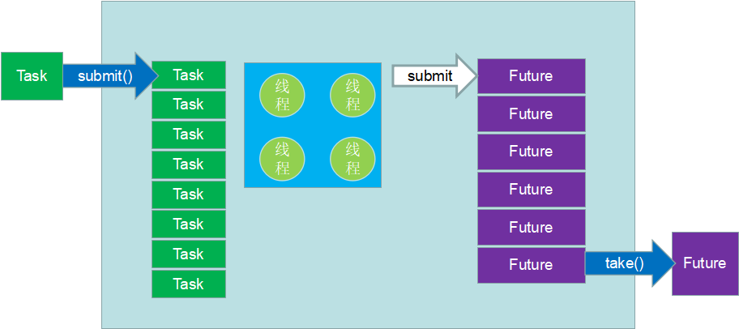

# ✅并发调三个方法，实现只要有一个成功就立即成功，否则等都失败才失败

# 典型回答


有的时候，我们需要实现这样的功能，比如说我们有多个黑名单需要校验，为了提升效率，需要并发执行，执行过程中，如果有结果先返回了，就判断他是否命中了黑名单，如果命中，则不用再等后续的其他请求了，直接拒绝即可，否则就要等所有的请求都返回，所有的返回都是通过，返回通过。


想要实现这个功能，可以借助**CompletionService**。


CompletionService是Java8的新增接口，JDK为其提供了一个实现类ExecutorCompletionService。这个类是为线程池中Task的执行结果服务的，即为Executor中Task返回Future而服务的。


**CompletionService的实现目标是任务先完成可优先获取到，即结果按照完成先后顺序排序。**





主要的代码实现如下：


```yaml
//先创建一个线程池
ScheduledExecutorService blackListCheckExecutorService = new ScheduledThreadPoolExecutor(20,
            new BasicThreadFactory.Builder().namingPattern("multi-black-list-decision-%d").build());
            
//定义一个CompletionService，返回值为boolean类型 
CompletionService<Boolean> completionService = new ExecutorCompletionService<>(blackListCheckExecutorService);

//把要执行的任务提交给completionService
for (String blackListName : multiBlackListDecisionObject.getBlackListNames()) {
    completionService.submit(() -> getData(new BlackListDecisionObject(multiBlackListDecisionObject, blackListName)) != null);
}

try {
    int tasks = multiBlackListDecisionObject.getBlackListNames().size();
  	//再循环中不断尝试get返回结构
    while (tasks > 0) {
        Future<Boolean> future = completionService.take();
        boolean result = future.get();
      	//拿到一个结果后就判断是否为true
      	//只要有一个为true直接返回true
        if (result) {
            return true;
        }

        tasks--;
    }
  	//都执行完之后，没有true，则最终返回一次false
    return false;
} catch (InterruptedException | ExecutionException e) {
    return false;
}
```


> 更新: 2025-07-21 22:10:33  
> 原文: <https://www.yuque.com/hollis666/oolnrs/uqg78mvgakgkg7r4>