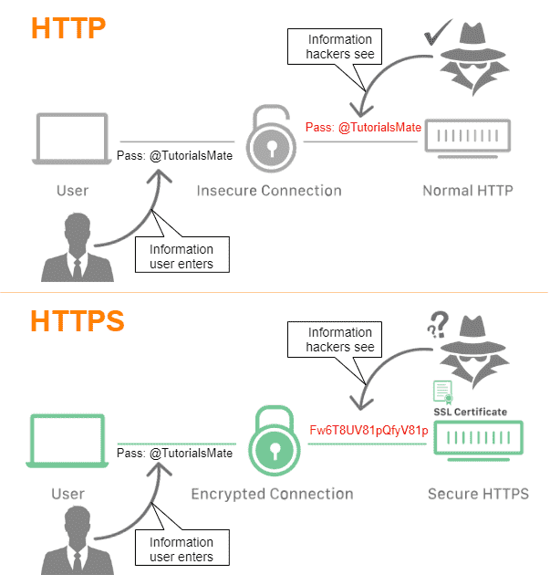

# ✅HTTPS和HTTP的区别是什么？

# 典型回答
HTTP和HTTPS是两种协议，分别是Hypertext Transfer Protocol和HyperText Transfer Protocol Secure。

HTTPS还经常被称之为HTTP over SSL或者HTTP over TSL，HTTPS经由HTTP进行通信，但利用SSL/TLS来[加密](https://zh.wikipedia.org/wiki/%E5%8A%A0%E5%AF%86)数据包。

他们的区别主要由以下几个方面：

1. 安全性:
    - HTTP: HTTP是明文传输的，这意味着数据在传输过程中不加密，容易受到中间人攻击。敏感信息，如密码和信用卡号，如果通过HTTP传输，可能会被窃取。
    - HTTPS: HTTPS使用SSL（Secure Sockets Layer）或其继任者TLS（Transport Layer Security）来加密数据传输，使数据在传输过程中加密，更难被中间人攻击窃取。
2. URL:
    - HTTP: HTTP的URL以http://开头
    - HTTPS: HTTPS的URL以https://开头
3. 证书:
    - HTTP: HTTP不需要使用数字证书。
    - HTTPS: HTTPS需要使用数字证书，这个证书由受信任的第三方机构（如CA，Certificate Authority）颁发，用于验证网站的身份。
4. 默认端口:
    - HTTP: 默认端口为80。
    - HTTPS: 默认端口为443。
5. 性能:
    - HTTP: 由于不需要加密和解密数据，HTTP的性能通常比HTTPS更高。这在某些情况下可以使HTTP成为更好的选择，尤其是对于不涉及敏感信息的静态内容传输。
    - HTTPS: HTTPS需要进行加密和解密操作，这会增加一些计算开销，但现代计算机和服务器通常能够很好地处理这种负担。

# 扩展知识

## TLS VS SSL

TLS（Transport Layer Security）和 SSL（Secure Sockets Layer）都是加密通信协议，用于在计算机网络上保护数据传输的安全性。

|  | SSL | TLS |
| --- | --- | --- |
| 全称 | Secure Sockets Layer | Transport Layer Security |
| 重要版本 | SSL 1.0 SSL 2.0 SSL 3.0 | TLS 1.0 TLS 1.1 TLS 1.2 TLS 1.3 |
| 使用情况 | SSL各个版本都存在安全漏洞，目前用的比较少 | TLS 1.2和TLS 1.3是目前最广泛使用的版本，因为它们提供更高的安全性。 |
| 性能 | TLS的性能通常比SSL更好，尤其是TLS 1.2和TLS 1.3版本，因为它们引入了更有效的加密算法和协议优化。 | |

> 更新: 2025-07-21 22:10:33  
> 原文: <https://www.yuque.com/hollis666/oolnrs/nixwqt>