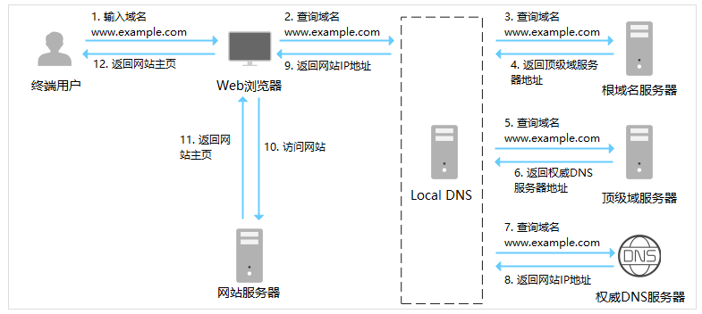

# ✅简单介绍一下DNS？

# 典型回答

DNS，是Domain Name System的缩写，翻译成域名系统。它作为将域名和IP地址相互映射的一个分布式数据库，能够使人更方便地访问互联网。

**DNS最主要的作用就是将域名翻译成ip地址。**

> IP地址是IP Address的缩写，指互联网协议地址（英语：Internet Protocol Address，又译为网际协议地址）。IP地址是IP协议提供的一种统一的地址格式，它为互联网上的每一个网络和每一台主机分配一个逻辑地址，以此来屏蔽物理地址的差异。
>

互联网上的每一台计算机，都会分配到一个IP地址。IP地址被用来给Internet上的电脑一个编号。大家日常见到的情况是每台联网的PC上都需要有IP地址，才能正常通信。

IP地址是一个32位的二进制数，通常被分割为4个“8位二进制数”（也就是4个字节）。IP地址通常用“点分十进制”表示成（a.b.c.d）的形式。如：208.80.152.2

> 域名，这个是很多人都熟悉的概念，我们大多数情况下，在浏览器上访问某个网站的时候，都是通过域名访问的。
>

域名是由一串用点分隔的字符组成的互联网上某一台计算机或计算机组的名称，用于在数据传输时标识计算机的电子方位。

域名可以说是一个IP地址的代称，目的是为了便于记忆后者。

例如，wikipedia.org是一个域名，和IP地址208.80.152.2相对应。人们可以直接访问wikipedia.org来代替IP地址，然后域名系统（DNS）就会将它转化成便于机器识别的IP地址。

这样，人们只需要记忆wikipedia.org这一串带有特殊含义的字符，而不需要记忆没有含义的数字。

### DNS解析
在现实生活中，我们可能经常需要通过电话找人，每一台接入网络的电话都有一个自己独一无二的号码。

有的时候，我们想要打某个公司的客服电话，如想要给工商银行的客服打电话，想查询账户余额。但是我们不知道具体号码，我们可以拨打114，告诉他们自己想要拨打工商银行的电话。然后114的客服会帮你查询到工商银行的电话，并帮你自动转接到工商银行的客服电话。

这个过程就和域名、IP地址以及DNS之间的关系比较像了。

    每一台接入网络的电话 -> 每一台接入网络的计算机

    工商银行-> 域名

    电话号码 -> ip地址

    114咨询台  -> DNS

有了DNS，我们不需要记住每一个网站的多个IP地址，我们只需要知道这个网站的域名就可以了。就像我们不关心工商银行的客服电话，我们只需要知道我们要找工商银行就可以了。

而且，对于一个网站来说，一个域名会对应其无数个IP地址。会通过负载均衡等方式进行调配。就像工商银行的客服中心也有很多分机的道理是一样的。

当我们在浏览器中键入一个域名时，浏览器会向**本地DN**S解析器发送一个查询请求（在这之前会先查一下浏览器缓存以及本地的host绑定），询问该域名对应的IP地址。如果本地DNS解析器不知道该域名的IP地址，它将向**根DNS服务器**发送请求。

> 根DNS服务器是DNS层次结构的最顶层，它不直接提供域名和IP地址的映射，而是指向顶级域名服务器。
>

然后，本地DNS解析器将向**顶级域名服务器**发送请求，顶级域名服务器是负责特定顶级域（如.com、.org、.net等）的服务器。顶级域名服务器会告诉本地DNS解析器该域名对应的权威域名服务器。

接着，本地DNS解析器将向**权威域名服务器**发送请求，该服务器是管理该域名的DNS记录的服务器。**权威域名服务器**会返回该域名对应的IP地址给本地DNS解析器。

最后，本地DNS解析器将把IP地址返回给Web浏览器，我么就可成功访问了

# 扩展知识

## DNS污染

网域服务器缓存污染（DNS cache pollution），又称域名服务器缓存投毒（DNS cache poisoning），是指一些刻意制造或无意中制造出来的域名服务器数据包，把域名指往不正确的IP地址。

其工作方式是：由于通常的DNS查询没有任何认证机制，而且DNS查询通常基于的UDP是无连接不可靠的协议，因此DNS的查询非常容易被篡改，通过对UDP端口53上的DNS查询进行入侵检测，一经发现与关键词相匹配的请求则立即伪装成目标域名的解析服务器（NS，Name Server）给查询者返回虚假结果。

DNS污染指的是用户访问一个地址，国内的服务器(非DNS)监控到用户访问的已经被标记地址时，服务器伪装成DNS服务器向用户发回错误的地址的行为。为了减免网络上的交通，一般的域名都会把外间的域名服务器数据暂存起来，待下次有其他机器要求解析域名时，可以立即提供服务。一旦有关网域的局域域名服务器的缓存受到污染，就会把网域内的电脑导引往错误的服务器或服务器的网址。

简单点说，DNS污染是指把自己伪装成DNS服务器，在检查到用户访问某些网站后，使域名解析到错误的IP地址。

## DNS劫持

DNS劫持又称域名劫持，是指在劫持的网络范围内拦截域名解析的请求，分析请求的域名，把审查范围以外的请求放行，否则返回假的IP地址或者什么都不做使请求失去响应，其效果就是对特定的网络不能访问或访问的是假网址。

简单点说，DNS劫持指的是通过非法手段，获取DNS服务器的权限，然后把DNS配置进行修改，使域名解析到错误的IP地址。

## DNS污染和DNS劫持的区别

DNS劫持是劫持了DNS服务器，进而修改其解析结果。

DNS污染是国内的某些服务器对DNS查询进行入侵检测，发现与黑名单上匹配的请求，该服务器就伪装成DNS服务器，给查询者返回虚假结果。它利用了UDP协议是无连接不可靠性。

一个是劫持了DNS服务器，一个是伪装成DNS服务器。造成的结果都是返回错误的IP地址。

> 更新: 2025-07-21 22:10:36  
> 原文: <https://www.yuque.com/hollis666/oolnrs/oa7q69>