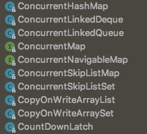

# ✅同步容器（如Vector）的所有操作一定是线程安全的吗？

# 典型回答


**同步容器是通过加锁实现线程安全的，并且只能保证单独的操作是线程安全的，无法保证复合操作的线程安全性。并且同步容器的读和写操作之间会互相阻塞。**


在多线程场景中，如果使用同步容器，一定要注意复合操作的线程安全问题。必要时候要主动加锁。在并发场景中，建议直接使用java.util.concurent包中提供的容器类，如果需要复合操作时，建议使用有些容器自身提供的复合方法。


什么是同步容器？最常见的同步容器就是Vector和Hashtable了，在Java中，同步容器主要包括2类：

+ 1、Vector、Stack、HashTable
+ 2、Collections类中提供的静态工厂方法创建的类


本文拿相对简单的Vecotr来举例，我们先来看下Vector中几个重要方法的源码：

<font style="color:rgb(51, 51, 51);"></font>

```java
public synchronized boolean add(E e) {
    modCount++;
    ensureCapacityHelper(elementCount + 1);
    elementData[elementCount++] = e;
    return true;
}

public synchronized E remove(int index) {
    modCount++;
    if (index >= elementCount)
        throw new ArrayIndexOutOfBoundsException(index);
    E oldValue = elementData(index);

    int numMoved = elementCount - index - 1;
    if (numMoved > 0)
        System.arraycopy(elementData, index+1, elementData, index,
                         numMoved);
    elementData[--elementCount] = null; // Let gc do its work

    return oldValue;
}

public synchronized E get(int index) {
    if (index >= elementCount)
        throw new ArrayIndexOutOfBoundsException(index);

    return elementData(index);
}
```


可以看到，Vector这样的同步容器的所有公有方法全都是synchronized的，也就是说，我们可以在多线程场景中放心的使用单独这些方法，因为这些方法本身的确是线程安全的。


但是，请注意上面这句话中，有一个比较关键的词：**单独**


因为，虽然同步容器的所有方法都加了锁，但是对这些容器的复合操作无法保证其线程安全性。需要客户端通过主动加锁来保证。


简单举一个例子，我们定义如下删除Vector中最后一个元素方法：


```java
public Object deleteLast(Vector v){
    int lastIndex  = v.size()-1;
    v.remove(lastIndex);
}
```


上面这个方法是一个复合方法，包括size(）和remove()，乍一看上去好像并没有什么问题，无论是size()方法还是remove()方法都是线程安全的，那么整个deleteLast方法应该也是线程安全的。


但是时，如果多线程调用该方法的过程中，remove方法有可能抛出ArrayIndexOutOfBoundsException。


```java
Exception in thread "Thread-1" java.lang.ArrayIndexOutOfBoundsException: Array index out of range: 879
    at java.util.Vector.remove(Vector.java:834)
    at com.hollis.Test.deleteLast(EncodeTest.java:40)
    at com.hollis.Test$2.run(EncodeTest.java:28)
    at java.lang.Thread.run(Thread.java:748)
```


我们上面贴了remove的源码，我们可以分析得出：当index >= elementCount时，会抛出ArrayIndexOutOfBoundsException ，也就是说，当当前索引值不再有效的时候，将会抛出这个异常。


因为removeLast方法，有可能被多个线程同时执行，当线程2通过index()获得索引值为10，在尝试通过remove()删除该索引位置的元素之前，线程1把该索引位置的值删除掉了，这时线程一在执行时便会抛出异常。


  
 

为了避免出现类似问题，可以尝试加锁：


```java
public void deleteLast() {
    synchronized (v) {
        int index = v.size() - 1;
        v.remove(index);
    }
}
```


如上，我们在deleteLast中，对v进行加锁，即可保证同一时刻，不会有其他线程删除掉v中的元素。


另外，如果以下代码会被多线程执行时，也要特别注意：


```java
for (int i = 0; i < v.size(); i++) {
    v.remove(i);
}
```


由于，不同线程在同一时间操作同一个Vector，其中包括删除操作，那么就同样有可能发生线程安全问题。所以，在使用同步容器的时候，如果涉及到多个线程同时执行删除操作，就要考虑下是否需要加锁。


### 同步容器的问题
前面说过了，同步容器直接保证单个操作的线程安全性，但是无法保证复合操作的线程安全，遇到这种情况时，必须要通过主动加锁的方式来实现。


而且，除此之外，同步容器由于对其所有方法都加了锁，这就导致多个线程访问同一个容器的时候，只能进行顺序访问，即使是不同的操作，也要排队，如get和add要排队执行。这就大大的降低了容器的并发能力。


### <font style="color:rgb(51, 51, 51);">并发容器</font>
<font style="color:rgb(51, 51, 51);">针对前文提到的同步容器存在的并发度低问题，从Java5开始，java.util.concurent包下，提供了大量支持高效并发的访问的集合类，我们称之为并发容器。</font>

<font style="color:rgb(51, 51, 51);"></font>



<font style="color:rgb(51, 51, 51);"></font>

针对前文提到的同步容器的复合操作的问题，一般在Map中发生的比较多，所以在ConcurrentHashMap中增加了对常用复合操作的支持，比如"若没有则添加"：putIfAbsent()，替换：replace()。这2个操作都是原子操作，可以保证线程安全。


[✅ConcurrentHashMap是如何保证线程安全的？](https://www.yuque.com/hollis666/oolnrs/seuqd9oynk2enp9t)


另外，并发包中的CopyOnWriteArrayList和CopyOnWriteArraySet是Copy-On-Write的两种实现。


[✅什么是COW，如何保证的线程安全？](https://www.yuque.com/hollis666/oolnrs/sn842t5l24dmlsp4)


Copy-On-Write容器即写时复制的容器。通俗的理解是当我们往一个容器添加元素的时候，不直接往当前容器添加，而是先将当前容器进行Copy，复制出一个新的容器，然后新的容器里添加元素，添加完元素之后，再将原容器的引用指向新的容器。


CopyOnWriteArrayList中add/remove等写方法是需要加锁的，而读方法是没有加锁的。


这样做的好处是我们可以对CopyOnWrite容器进行并发的读，当然，这里读到的数据可能不是最新的。因为写时复制的思想是通过延时更新的策略来实现数据的最终一致性的，并非强一致性。


但是，作为代替Vector的CopyOnWriteArrayList并没有解决同步容器的复合操作的线程安全性问题。


> 更新: 2025-07-21 22:11:35  
> 原文: <https://www.yuque.com/hollis666/oolnrs/zvdr34qim77wfrsm>