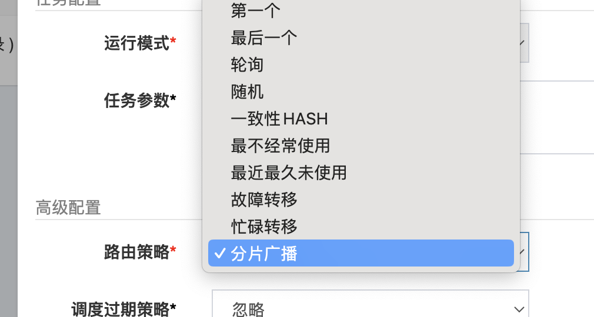

# ✅基于XXL-JOB的分片实现分库分表后的扫表

### （本项目亮点来自我的[数藏项目](https://www.yuque.com/hollis666/oolnrs/dgolk0cckpb94sia)文档中的最佳实践部分，更多项目亮点难点（50+），更详细的落地方案和讲解，可以在项目课中和我们一起学）


在我的数藏项目中，需要通过定时任务来扫描订单表，进行超时未支付的订单的关单操作。


但是因为我们的表是做了分库分表的，并且数据量会很大，单机任务扫表的性能可能不能满足要求，会比较慢，导致任务堆积。


为了解决这个问题，我们采用多线程扫表的方案，这里基于 XXL-JOB 的分片功能，充分利用集群中的所有实例进行任务处理，并且在每个任务的执行过程中，采用生产者消费者模式，在基于线程池进行快速消费。本文介绍 XXL-JOB 的分片任务。（整体方案见[数藏项目](https://www.yuque.com/hollis666/oolnrs/dgolk0cckpb94sia)）


### XXL-JOB 的分片任务


在XXL-JOB中，分片任务指的是将一个大任务分解为多个小任务，这些小任务可以分布在不同的执行器上并行执行。这种方式可以有效地利用集群资源，加快任务执行速度，特别适用于数据量大的批处理任务。


在 XXL-JOB 的配置时，路由策略这里可以选择分片广播的方式进行调度。





在配置了这种调度方式后，任务调度的时候就可以同时调度多个实例进行处理。XXL-JOB 会给每个实例传递两个分片参数：


+ **分片总数（Sharding Total）**：表示任务被分成多少片。例如，如果设置为3，则表示任务被分为3片。其实就是你集群中服务器的数量。
+ **分片序号（Sharding Index）**：表示当前执行器执行的是哪一片。序号从0开始，最大值为分片总数减1。


在任务执行的代码中，可以通过调用XxlJobHelper.getShardIndex()和XxlJobHelper.getShardTotal()方法获取当前执行器的分片序号和总分片数。


然后就可以根据获取到的分片信息，编写相应的逻辑来确定该执行器需要处理的数据范围或任务。


如：

```sql
select * from table where user_id % 4 = 1
```


以上 SQL 只是举个例子，让你更容易理解，实际使用的时候，会考虑索引的使用。但是思想就是这样的。


如我们的超时任务执行器中，就通过XxlJobHelper取出了shardIndex和shardTotal，然后再把根据用户 ID 的末尾2位对shardTotal进行取模。如果取模的结果和shardIndex相等，则执行任务，不相等的，则交给其他分片执行即可。


```java
@XxlJob("orderTimeOutExecute")
@Deprecated
public ReturnT<String> orderTimeOutExecute() {
    try {
        int shardIndex = XxlJobHelper.getShardIndex();
        int shardTotal = XxlJobHelper.getShardTotal();

        LOG.info("orderTimeOutExecute start to execute , shardIndex is {} , shardTotal is {}", shardIndex, shardTotal);

        List<String> buyerIdTailNumberList = new ArrayList<>();
        for (int i = 0; i < 99; i++) {
            if (i % shardTotal == shardIndex) {
                buyerIdTailNumberList.add(StringUtils.leftPad(String.valueOf(i), 2, "0"));
            }
        }
    }
}
```


举个例子，如果一共5台实例，那么每台机器的shardTotal都是5，然后他们的shardIndex是从0到4的。这样接收到shardIndex=0的这台机器，就会只处理 userId 的尾号 % 5 == 0的所有用户数据，而接收到shardIndex=1的这台机器，就会只处理 userId 的尾号 % 5 == 1的所有用户数据。。。


就这样，5台机器分别处理不同的数据，大家互相不影响。


但是这么做有个问题，就是用用户id尾号进行like查询，是没办法用到索引的，所以在这个方案的基础上我们做了进一步优化解决这个无法用到索引的问题。


基本方案就是单独冗余一个逆序的userid，然后用这个逆序的userid来做like查询。把原来的 like "%xx" 转变成 like "xx%"。


[✅MySQL中like的模糊查询如何优化](https://www.yuque.com/hollis666/oolnrs/zrt2y30mhdgiremc)


### （本项目亮点来自我的[数藏项目](https://www.yuque.com/hollis666/oolnrs/dgolk0cckpb94sia)文档中的最佳实践部分，更多项目亮点难点（50+），更详细的落地方案和讲解，可以在项目课中和我们一起学）


> 更新: 2025-07-21 22:10:42  
> 原文: <https://www.yuque.com/hollis666/oolnrs/ikdbgt9mpm46u298>