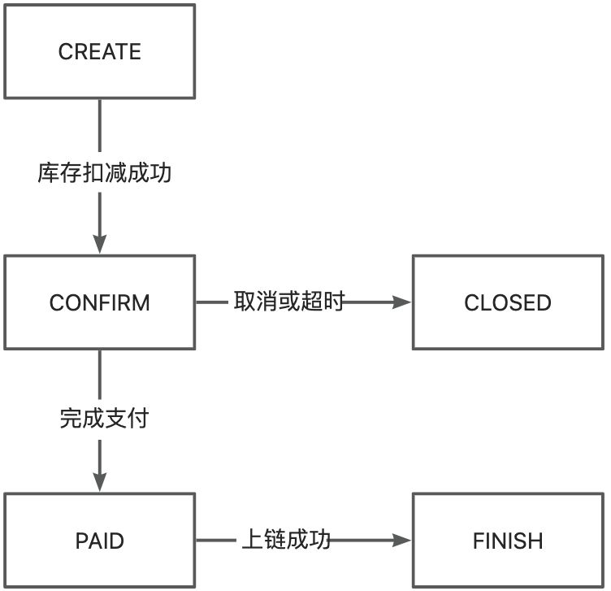
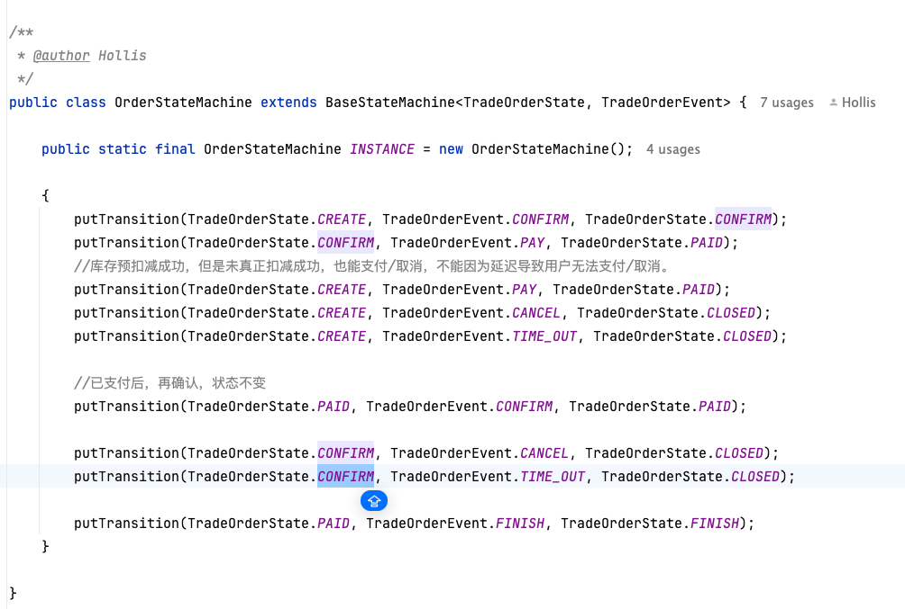
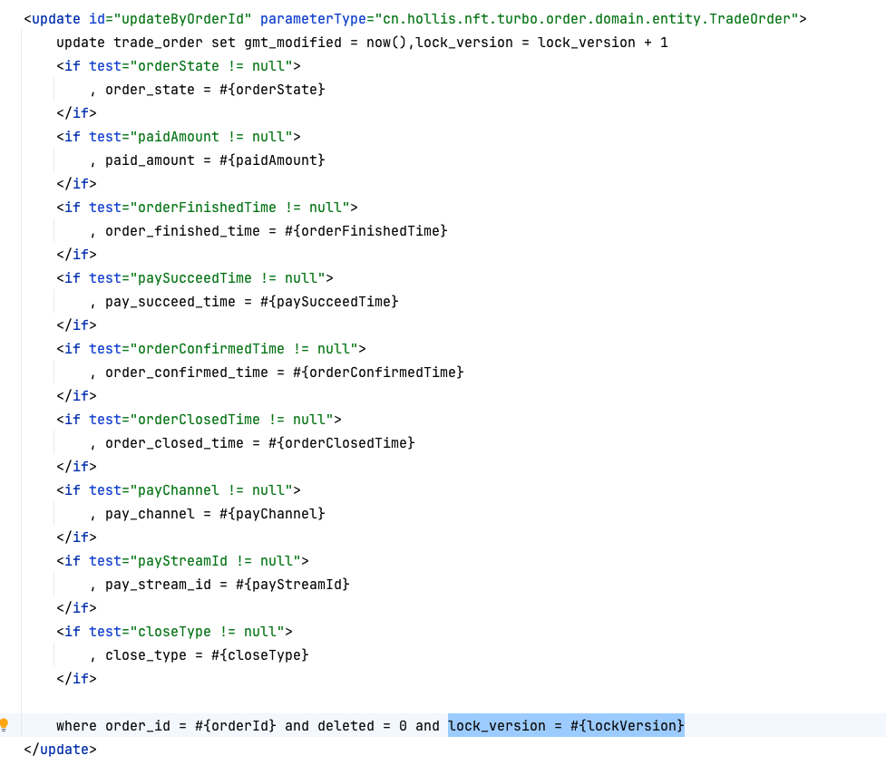
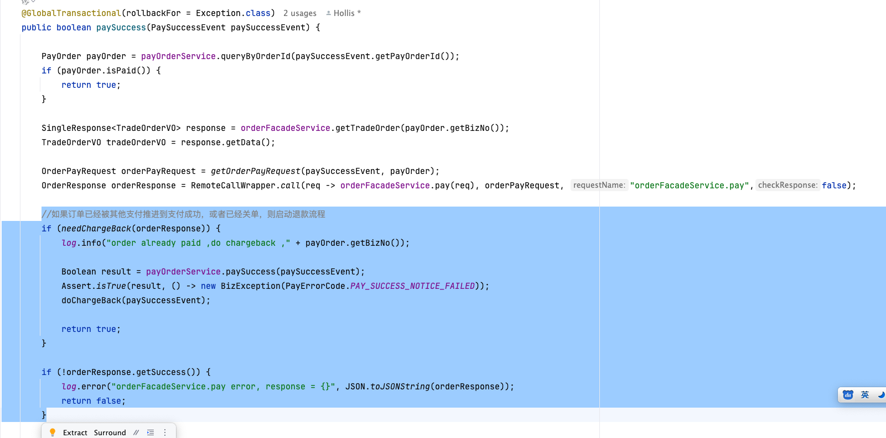

# ✅基于状态机+乐观锁解决订单支付和关单的并发问题

### （本项目亮点来自我的[数藏项目](https://www.yuque.com/hollis666/oolnrs/dgolk0cckpb94sia)文档中的最佳实践部分，更多项目亮点难点（50+），更详细的落地方案和讲解，可以在项目课中和我们一起学）

假如，有一笔订单，在10:00下单成功，超时时间是30分钟，那么在10:30点的时候，支付成功和关单同时来了，这时候该如何处理？

我们的做法是基于状态机+乐观锁来确保只有一个线程能成功，后面的线程则执行失败。

### 明确终态
这是一个比较常见的一个并发处理的问题，而且也是业务中比较常见的问题，我们的订单的状态机如下：

在我们的订单状态机的控制中，可以看到 CONFIRM 的状态，只能推进到 PAID 或者 CLOSED。

那么也就是说，如果一个订单当前已经是PAID 了，就不能再 CLOSED 了，反之亦然，也就是说，不管是支付成功、还是取消（超时关单）哪个先执行了，另外一个动作都会执行失败，会被我们的状态机给限制住。

关于订单的状态机的使用，见：[✅统一状态机设计（项目课文档）](https://www.yuque.com/hollis666/oolnrs/dgolk0cckpb94sia)

有了这个之后，就可以完全避免并发吗？并不能，因为在极端的并发情况下，因为状态机是在从数据库查询出来数据之后做的判断，那么就有可能支付成功的线程和关单的线程从数据库查询的时候都是 CONFIRM，这时候状态机判断就可以通过。

那么这个问题如何解决呢？就靠我们的乐观锁了。

在我们的orderMapper.updateByOrderId方法中，是加了乐观锁的：

也就是说，虽然两个线程查询到的状态都是 CONFIRM，并且 lock_version 都是1的话，在最终更新的时候，因为做了乐观锁的判断，只会有一个线程能执行成功，因为他执行成功后会把 lock_version 改成2，另一个线程用lock_version=1当作 where 条件更新就会失败了。

就这样，就避免了并发。那也就是说一旦发生了并发，就会有一个成功了，就有一个会失败。这是必然的，这时候就有两种情况了：

1、支付成功处理成功，关单处理失败

2、关闭处理成功，支付成功处理失败

这两种情况如何处理呢？

### 逆向流程
先说简单的情况，假如支付成功处理成功，关闭处理失败，这种其实没啥问题，因为已经支付成功了，超时的请求直接拒绝掉就行了。这是业务上正常的逻辑。

第二种情况就不好处理了，因为对于支付超时处理成功了，但是支付成功处理失败这种，我们就需要考虑，钱怎么办？

用户把钱付完了，但是支付却没成功，这肯定是业务上接受不了的。那这时候怎么办呢？

办法就是：**原路退回**

****

当出现这种情况的时候，我们是可以识别出来的，也就是说在支付成功的处理过程中，如果发现支付单被关闭了，那么就触发原路退回的流程，把钱再给用户退回去。

为啥非要退款？而不是让订单推进到成功，或者再补一个支付单。

一方面，状态机中已取消一定是一个终态，终态再流转到其他状态不合理。

另一方面，在订单超时的业务逻辑中，可能直接把库存退回去了，营销券也释放了，那么这时候补一个支付单是不现实的。

实现逻辑如下：

这里的needChargeBack就是判断是否需要退款的，退款判断如下：

也就是说，如果orderFacadeService.pay返回的 responseCode 如果是ORDER_ALREADY_PAID或者ORDER_ALREADY_CLOSED就会执行退款。

ORDER_ALREADY_PAID是多付的情况，我们这里不讨论，详见：[✅重复支付问题如何解决？（项目课文档）](https://www.yuque.com/hollis666/oolnrs/dgolk0cckpb94sia)

ORDER_ALREADY_CLOSED是什么情况才会有的呢，那么深入orderFacadeService.pay去看：

就是这里，当orderService.pay(request);失败之后，反查一下订单，如果状态是已经关闭了，则返回ORDER_ALREADY_CLOSED。

那么我们上面提到的，状态机校验不过，和更新失败（结果数为0）的时候，都会返回失败的。就会走到我们说的逻辑了。

### （本项目亮点来自我的[数藏项目](https://www.yuque.com/hollis666/oolnrs/dgolk0cckpb94sia)文档中的最佳实践部分，更多项目亮点难点（50+），更详细的落地方案和讲解，可以在项目课中和我们一起学）

> 更新: 2025-07-21 22:10:40  
> 原文: <https://www.yuque.com/hollis666/oolnrs/wivav02l47kcd9nl>