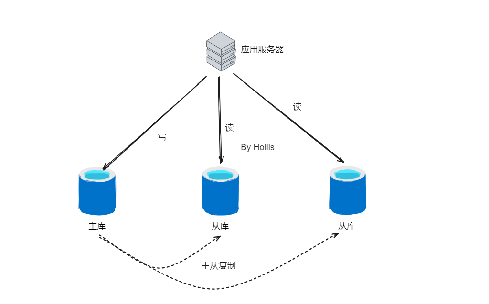
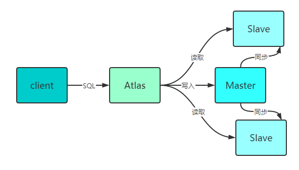
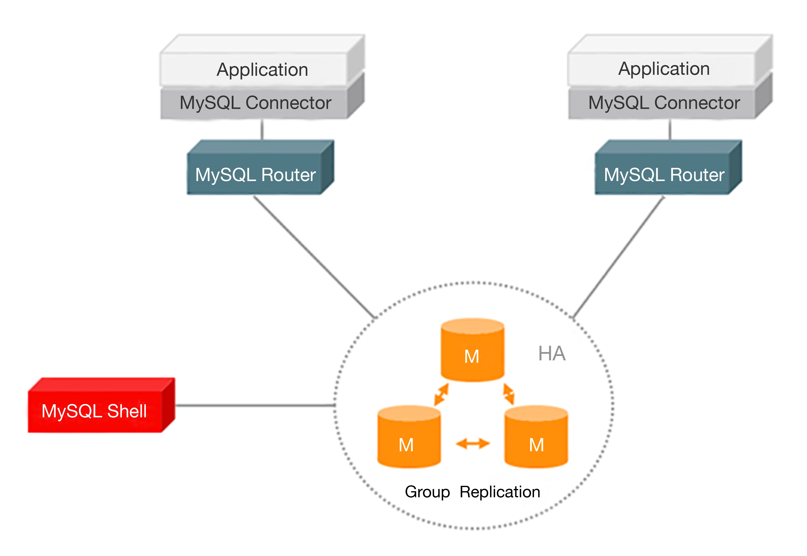

# ✅什么是读写分离？如何实现？

# 典型回答


在分布式系统设计中，读写分离是一种常见的架构模式，可以提升系统的处理能力、扩展性和可用性。简单来说就是分开处理读和写操作。


+ **读操作**：通常指的是从数据库中检索数据的操作，比如 SQL 查询。
+ **写操作**：包括创建、更新或删除数据库中的数据，比如 SQL 的 INSERT、UPDATE、DELETE 语句。

<font style="color:rgb(13, 13, 13);"></font>

读写分离的好处：

1. **提高性能**：**一般来说，大型分布式应用中都是读多写少的**。将读写操作分离可以显著提高数据库系统的整体性能。
2. **提高可扩展性**：读写分离允许系统按需增加从数据库实例，以应对读请求量的增长，从而提高系统的可扩展性。
3. **增加可用性和容错性**：在主-从复制架构中，如果主数据库出现故障，可以从从数据库中选举或提升一个为新的主数据库，从而减少系统的停机时间。
4. **负载均衡**：通过在多个从数据库之间分散读请求，可以实现负载均衡，避免单个数据库的过载，从而提高系统的响应速度和稳定性。

<font style="color:rgb(13, 13, 13);"></font>

我们都知道MySQL提供了主从复制的能力，所以我们就可以基于MySQL自带的主从复制的能力来实现读写分离。


[✅MySQL主从复制的过程](https://www.yuque.com/hollis666/oolnrs/hoi4ql)


在这种模式下，写操作只在主数据库（Master）上执行，而读操作则可以在从数据库（Slave）上执行。主库和从库通过主从复制来保持数据的同步。





在通过主从复制实现读写分离的架构中，从库可以是一个，也可以是多个。也就是说可以是一主一从、也可以是一主多从。


## 如何做读写的分流？


如何实现让写流量请求到主库，读流量请求到从库呢，这就涉及到具体的读写分流了。


一般来说，首先我们需要把接口从定义上或者从职责上划分清楚，读接口和写接口。如UserReadService就是专门负责提供读服务的，UserWriteService就是专门负责写服务的。


接下来，ReadService在操作的时候，只需要和从库进行交互，而WriteServie在操作的时候只需要和主库进行操作就行了。具体分流方式有以下集中：


### 1、代码分流


最简单直观的方式，就是我们自己编码实现，我们可以在DAO层定义多个数据源，然后在实际进行读或者写操作的时候，选择使用不同的数据源即可。


如以下方式定义两个不同的DataSource：


```java
@Configuration
public class DataSourceConfig {

    @Bean
    @Primary
    public DataSource primaryDataSource() {
        // 配置主数据源
        return DataSourceBuilder.create().url("jdbc:mysql://master_db:3306/mydb").username("user").password("pass").build();
    }

    @Bean
    public DataSource replicaDataSource() {
        // 配置从数据源
        return DataSourceBuilder.create().url("jdbc:mysql://replica_db:3306/mydb").username("user").password("pass").build();
    }
}
```


在定义一个动态数据源：


```java
public class DynamicDataSource extends AbstractRoutingDataSource {
    @Override
    protected Object determineCurrentLookupKey() {
        // 你可以根据实际情况来决定使用哪个数据源
        return DbContextHolder.getDbType();
    }
}
```


在 Spring 配置中设置 DynamicDataSource，并将之前定义的主从数据源作为目标数据源。


```java
@Configuration
public class RoutingConfig {

    @Autowired
    @Qualifier("primaryDataSource")
    private DataSource primaryDataSource;

    @Autowired
    @Qualifier("replicaDataSource")
    private DataSource replicaDataSource;

    @Bean
    public DataSource dataSource() {
        DynamicDataSource dynamicDataSource = new DynamicDataSource();
        Map<Object, Object> targetDataSources = new HashMap<>();
        targetDataSources.put(DbType.MASTER, primaryDataSource);
        targetDataSources.put(DbType.SLAVE, replicaDataSource);
        dynamicDataSource.setTargetDataSources(targetDataSources);
        dynamicDataSource.setDefaultTargetDataSource(primaryDataSource); // 默认使用主数据源
        return dynamicDataSource;
    }
}
```


<font style="color:rgb(13, 13, 13);">通过 AOP 在业务层或 DAO 层方法调用前动态切换数据源。可以基于注解或方法名称约定来拦截方法调用。针对find方法使用从库，针对insert方法使用主库。</font>

<font style="color:rgb(13, 13, 13);"></font>

```java
@Aspect
@Component
public class DataSourceAspect {

    @Before("execution(* com.example.repository..*.find*(..)) || execution(* com.example.repository..*.get*(..))")
    public void setReadDataSourceType() {
        DbContextHolder.setDbType(DbType.SLAVE);
    }

    @Before("execution(* com.example.repository..*.insert*(..)) || execution(* com.example.repository..*.update*(..))")
    public void setWriteDataSourceType() {
        DbContextHolder.setDbType(DbType.MASTER);
    }

    @After("execution(* com.example.repository..*.*(..))")
    public void clearDataSourceType() {
        DbContextHolder.clearDbType();
    }
}


public class DbContextHolder {

    private static final ThreadLocal<DbType> contextHolder = new ThreadLocal<>();

    public static void setDbType(DbType dbType) {
        contextHolder.set(dbType);
    }

    public static DbType getDbType() {
        return contextHolder.get();
    }

    public static void clearDbType() {
        contextHolder.remove();
    }

    public enum DbType {
        MASTER, SLAVE
    }
}

```


<font style="color:rgb(51, 51, 51);">这种方案的好处就是实现起来简单，我们可以根据业务做各种定制化，灵活性非常好。</font>

<font style="color:rgb(51, 51, 51);"></font>

### <font style="color:rgb(51, 51, 51);">2、借助中间件</font>


对于这种读写分离的场景，有很多中间件就天然支持的。比如[Sharding-JDBC](https://shardingsphere.apache.org/document/legacy/3.x/document/cn/manual/sharding-jdbc/usage/read-write-splitting/)<font style="color:rgb(51, 51, 51);"> 、TDDL等，都是支持读写分离的。</font>

<font style="color:rgb(51, 51, 51);"></font>

<font style="color:rgb(50, 50, 50);">他们的实现原理主要是根据 SQL 语义的分析，将读操作和写操作分别路由至主库与从库。</font>

<font style="color:rgb(50, 50, 50);"></font>


### 3、代理模式


除了上面提到的两种方案以外，还有一种方式，那就是在应用程序和数据库实例之间部署一组数据库代理实例，对应用程序来说，数据库代理把自己伪装成一个单节点的 MySQL 实例，应用程序的所有数据库请求被发送给代理，代理分离读写请求，然后转发给对应的数据库实例。


这种方案中，比较典型的是Atlas，这是奇虎360研发的数据中间层项目。Atlas是一个位于应用程序与MySQL之间中间件。在后端DB看来，Atlas相当于连接它的客户端，在应用层面看来，Atlas相当于一个DB服务器。


以一主多从为例。Atlas可以将读请求分发到两个从库节点，写请求分发到主库节点，实现读写分离。

  



<font style="color:rgb(51, 51, 51);">除了这种第三方的中间件以外，MySQL 8.2开始</font>的Router 也能用来做读写分离了。（[https://blogs.oracle.com/mysql/post/mysql-82-transparent-readwrite-splitting](https://blogs.oracle.com/mysql/post/mysql-82-transparent-readwrite-splitting) ）





**以上三个方案中，建议选择第二个方案，也就是用现有的一些应用层中间件来实现，这个方案在可靠性、侵入性、稳定性方面更加友好。**


# 扩展知识
## 读写分离与主从延迟


[✅读写分离遇到主从延迟怎么办？](https://www.yuque.com/hollis666/oolnrs/hhebmhl7td6da957)


> 更新: 2025-07-21 22:11:34  
> 原文: <https://www.yuque.com/hollis666/oolnrs/qdh6cgxyvvqrmkc8>